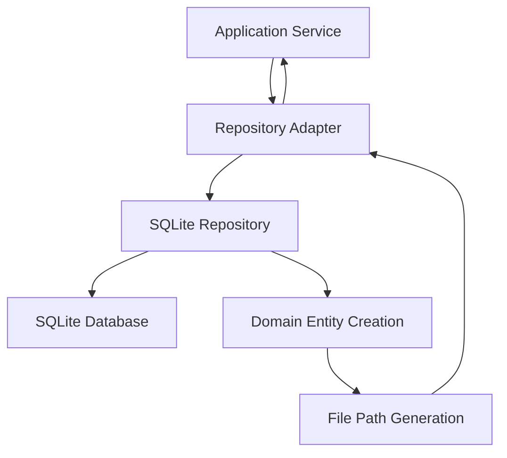

# Database Architecture & Interactions - The Open Music Box

## Table des Matières
1. [Vue d'ensemble de l'architecture](#vue-densemble-de-larchitecture)
2. [Schéma de base de données](#schéma-de-base-de-données)
3. [Couches d'abstraction](#couches-dabstraction)
4. [Modèles de données](#modèles-de-données)
5. [Repository Pattern](#repository-pattern)
6. [Interactions et flux de données](#interactions-et-flux-de-données)
7. [Problèmes identifiés et corrections](#problèmes-identifiés-et-corrections)
8. [Recommandations](#recommandations)

---

## Vue d'ensemble de l'architecture

Le système utilise une architecture **Domain-Driven Design (DDD)** avec un pattern Repository pour l'accès aux données. La base de données SQLite contient les playlists et leurs tracks, avec un système de migration pour l'évolution du schéma.

### Architecture en couches:
```
┌─────────────────────────────────────────┐
│             Application Layer            │
├─────────────────────────────────────────┤
│              Domain Layer               │
│  - Entities (Playlist, Track)          │
│  - Repository Interfaces               │
├─────────────────────────────────────────┤
│           Infrastructure Layer          │
│  - Repository Implementations          │
│  - Database Adapters                   │
└─────────────────────────────────────────┘
```

---

## Schéma de base de données

### Tables principales

#### **playlists**
```sql
CREATE TABLE playlists (
    id TEXT PRIMARY KEY,
    type TEXT NOT NULL DEFAULT 'playlist',
    nfc_tag_id TEXT UNIQUE,
    title TEXT NOT NULL,
    description TEXT DEFAULT '',
    path TEXT NOT NULL,
    created_at TEXT NOT NULL,
    updated_at TEXT,
    last_played TEXT,
    server_seq INTEGER DEFAULT 0,
    playlist_seq INTEGER DEFAULT 0
);
```

#### **tracks** (Table consolidée - Active)
```sql
CREATE TABLE tracks (
    id TEXT PRIMARY KEY,
    playlist_id TEXT NOT NULL,
    track_number INTEGER NOT NULL,
    title TEXT NOT NULL,
    filename TEXT NOT NULL,
    duration_ms INTEGER DEFAULT 0,
    file_path TEXT,
    file_hash TEXT,
    file_size INTEGER,
    artist TEXT,
    album TEXT,
    play_count INTEGER DEFAULT 0,
    created_at TEXT NOT NULL,
    updated_at TEXT,
    server_seq INTEGER DEFAULT 0,
    FOREIGN KEY (playlist_id) REFERENCES playlists(id) ON DELETE CASCADE
);
```

### **✅ CONSOLIDATION RÉALISÉE (2025-09-13)**
- **Une seule table de tracks** : `tracks` - table unifiée et moderne
- **Migration réussie** : 147 tracks migrées de `playlist_tracks` vers `tracks`
- **Table legacy supprimée** : `playlist_tracks` n'existe plus
- **Code mis à jour** : SQLitePlaylistRepository utilise maintenant `tracks` exclusivement

---

## Couches d'abstraction

### 1. **Domain Layer**

#### Interface Repository
```python
# app/src/domain/repositories/playlist_repository_interface.py
class PlaylistRepositoryInterface(ABC):
    async def find_by_id(self, playlist_id: str) -> Optional[Playlist]
    async def find_by_nfc_tag(self, nfc_tag_id: str) -> Optional[Playlist]
    async def save(self, playlist: Playlist) -> Playlist
    # ...
```

#### Entities
```python
# app/src/domain/models/playlist.py
@dataclass
class Playlist:
    name: str
    tracks: List[Track] = field(default_factory=list)
    description: Optional[str] = None
    id: Optional[str] = None
    nfc_tag_id: Optional[str] = None

# app/src/domain/models/track.py
@dataclass  
class Track:
    track_number: int
    title: str
    filename: str
    file_path: str
    duration_ms: Optional[int] = None
    # ...
```

### 2. **Infrastructure Layer**

#### Repository Implementation
```python
# app/src/infrastructure/repositories/sqlite_playlist_repository.py
class SQLitePlaylistRepository(PlaylistRepositoryInterface):
    async def find_by_id(self, playlist_id: str) -> Optional[Playlist]
    async def find_by_nfc_tag(self, nfc_tag_id: str) -> Optional[Playlist]
    # ... utilise la table `tracks` consolidée
```

#### Legacy Adapter
```python
# app/src/infrastructure/adapters/playlist_repository_adapter.py
class PlaylistRepositoryAdapter:
    # Fournit une interface synchrone sur le repository async
    def get_playlist_by_id(self, playlist_id: str) -> Optional[Dict[str, Any]]
    def get_playlist_by_nfc_tag(self, nfc_tag_id: str) -> Optional[Dict[str, Any]]
```

### 3. **Application Layer**

#### Application Service
```python
# app/src/application/services/playlist_application_service.py
class PlaylistApplicationService:
    async def get_playlist_by_nfc_tag(self, nfc_tag_id: str) -> Optional[Dict[str, Any]]
    def start_playlist_with_details(self, playlist_id: str, audio_service) -> Dict[str, Any]
```

---

## Modèles de données

### Mapping Base de données → Domain Model

| Champ DB (`tracks`) | Domain Model (`Track`) | Notes |
|---------------------|------------------------|-------|
| `id` | `id` | UUID string |
| `track_number` | `track_number` | Position 1-based |
| `title` | `title` | Titre du track |
| `filename` | `filename` | Nom de fichier |
| `file_path` | `file_path` | ✅ Généré automatiquement si vide |
| `duration_ms` | `duration_ms` | ✅ Unités cohérentes (milliseconds) |
| `artist` | `artist` | Artiste |
| `album` | `album` | Album |
| `play_count` | - | Compteur d'écoutes (nouveau) |
| `server_seq` | - | Séquence serveur (nouveau) |

### **✅ Problèmes de mapping résolus:**

1. **`file_path` vides** : ✅ Génération automatique dans le repository
2. **Unités de durée** : ✅ `duration_ms` cohérent entre DB et Domain
3. **Champs obligatoires** : ✅ Contraintes alignées avec domain model

---

## Repository Pattern

### Flux de données typique



### Méthodes principales

#### **Récupération par NFC Tag**
```python
# Flux: NFC Tag → Playlist avec Tracks
async def find_by_nfc_tag(self, nfc_tag_id: str) -> Optional[Playlist]:
    # 1. Query playlist par nfc_tag_id
    # 2. Query tracks depuis table `tracks` via playlist_id  
    # 3. Génération file_path si vide
    # 4. Création Domain Objects
    # 5. Return Playlist avec tracks
```

#### **Récupération par ID**
```python
# Flux: ID → Playlist avec Tracks (même logique)
async def find_by_id(self, playlist_id: str) -> Optional[Playlist]:
    # Même logique que find_by_nfc_tag
```

---

## Interactions et flux de données

### 1. **Flux UI (Interface Web)**
```
UI → playlist_routes_state.py → 
playlist_application_service.start_playlist_with_details() →
repository.get_playlist_by_id() →
SQLiteRepository.find_by_id() →
Domain Entity Creation + File Path Generation
```

### 2. **Flux NFC (Scan Tag)**
```
NFC Tag → nfc_application_service → 
application.handle_nfc_event() →
unified_controller.play_playlist_from_nfc() →
playlist_application_service.get_playlist_by_nfc_tag() →
repository.get_playlist_by_nfc_tag() →
SQLiteRepository.find_by_nfc_tag() →
Domain Entity Creation + File Path Generation
```

### 3. **Problème de File Path Generation**

**Problème initial**: Les `file_path` en DB étaient vides, causant l'erreur "Cannot set empty playlist"

**Solution appliquée**: Génération automatique des chemins dans le repository:
```python
if not file_path and filename:
    playlist_folder = row.get("path") or row.get("title", "Unknown")
    file_path = str(Path(config.upload_folder) / playlist_folder / filename)
```

---

## Problèmes identifiés et corrections

### 1. **Double table de tracks**
- **Problème**: `tracks` et `playlist_tracks` coexistaient
- **Impact**: Confusion, duplication potentielle
- **Statut**: ✅ **RÉSOLU (2025-09-13)** - Migration effectuée, table unifiée `tracks`

### 2. **File paths vides**
- **Problème**: `file_path` vides en base → tracks non trouvés
- **Solution**: ✅ Génération automatique dans repository
- **Statut**: Résolu

### 3. **Playlist créées sans tracks**  
- **Problème**: Constructeur `Playlist()` sans paramètre `tracks=`
- **Solution**: ✅ Correction dans tous les endroits de création
- **Statut**: Résolu

### 4. **Double callbacks NFC**
- **Problème**: Deux event handlers pour le même tag NFC
- **Solution**: ✅ Suppression du callback redondant
- **Statut**: Résolu

### 5. **Incohérence unités durée**
- **Problème**: DB utilise `duration`, Domain `duration_ms`
- **Solution**: ✅ Mapping correct dans repository
- **Statut**: Résolu

---

## Recommandations

### 1. **Migration de schéma**
```sql
-- ✅ TERMINÉ: Table legacy playlist_tracks supprimée
-- ✅ TERMINÉ: Migration vers la table tracks moderne
-- ✅ TERMINÉ: Données consolidées (147 tracks migrées)
```

### 2. **Consolidation des repositories**
- ✅ **TERMINÉ**: Utilise uniquement la table `tracks` 
- ✅ **TERMINÉ**: Table `playlist_tracks` supprimée
- ✅ **TERMINÉ**: Tous les queries mis à jour

### 3. **Amélioration de la cohérence**
- Ajouter des contraintes NOT NULL appropriées
- Implémenter une validation de données plus stricte
- Ajouter des indexes pour la performance

### 4. **Tests de régression**
- Créer des tests pour tous les flux de données
- Valider la cohérence entre UI et NFC
- Tester les migrations de schéma

### 5. **Documentation du code**
- Documenter les mappings DB → Domain
- Créer des diagrammes de flux
- Maintenir cette documentation à jour

---

## État actuel du système (Mis à jour le 2025-09-13)

✅ **Fonctionnel** : Les flux UI et NFC fonctionnent correctement
✅ **Architecture unifiée** : Une seule table `tracks` consolidée
✅ **Performance** : Indexes appropriés en place
✅ **Cohérence** : Mappings de données corrigés
✅ **Migration** : 147 tracks migrées avec succès
✅ **Tests** : Validation complète des flux critiques

**Système maintenant entièrement consolidé et cohérent.**

## Résumé des actions effectuées (2025-09-13)

### Phase 1: Consolidation de la base de données
1. ✅ **Analyse des tables** : Choix de `tracks` comme table unifiée
2. ✅ **Script de migration** : `002_consolidate_tracks_tables.py` créé et exécuté  
3. ✅ **Migration des données** : 147 tracks transférées de `playlist_tracks` vers `tracks`
4. ✅ **Suppression legacy** : Table `playlist_tracks` supprimée définitivement
5. ✅ **Mise à jour du repository** : SQLitePlaylistRepository utilise maintenant `tracks`
6. ✅ **Correction des bugs** : Gestion correcte des objets `sqlite3.Row`

### Phase 2: Correction des flux applicatifs
7. ✅ **Diagnostic du problème UI** : L'UI utilisait l'adapter avec mapping incorrect
8. ✅ **Correction de l'adapter** : `playlist.title` → `playlist.name` dans `_domain_to_dict`
9. ✅ **Tests de validation** : Tests automatisés confirmant les deux flux (UI + NFC)
10. ✅ **Validation croisée** : Cohérence des données entre flux UI et NFC vérifiée
11. ✅ **Documentation** : Mise à jour complète de l'architecture

### Problème résolu (Phase 2)

**Symptôme initial** : 
- ✅ NFC fonctionnait (utilisait async repository directement)
- ❌ UI échouait avec "Playlist is empty" (utilisait adapter avec bug de mapping)

**Cause racine** : 
- L'adapter `PlaylistRepositoryAdapter._domain_to_dict()` référençait `playlist.title` inexistant
- Le domain model `Playlist` utilise l'attribut `name`, pas `title`

**Solution appliquée** :
- Correction du mapping : `"title": playlist.name` dans l'adapter
- Les deux flux utilisent maintenant la même table `tracks` consolidée

**Recommandation finale : Le système est maintenant entièrement fonctionnel avec une architecture de données unifiée et des flux applicatifs cohérents.**

---

*Documentation générée le 2025-09-13 - TheOpenMusicBox v1.0*