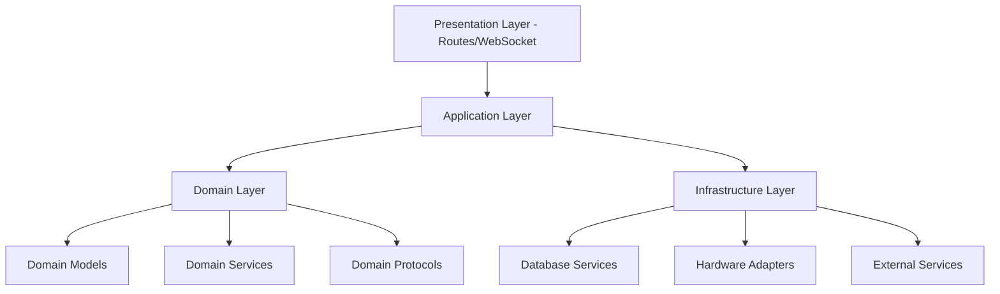
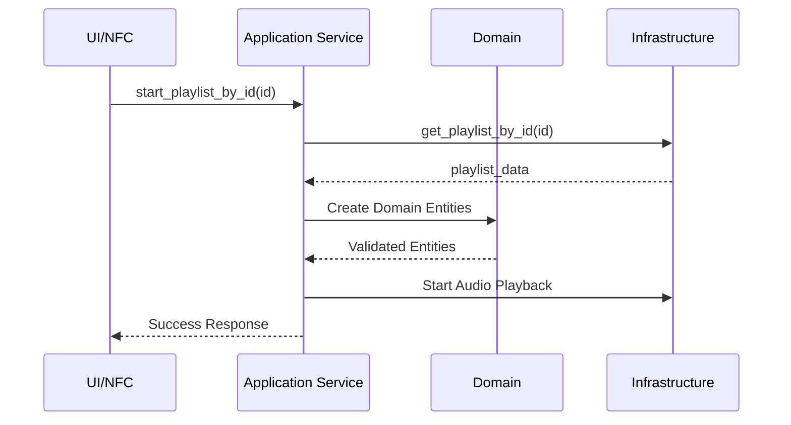

# Domain-Driven Design Architecture Documentation

## Overview

TheOpenMusicBox has been refactored to follow **Domain-Driven Design (DDD)** principles, establishing clear separation between Application, Domain, and Infrastructure layers. This architecture ensures maintainability, testability, and scalability.

## Architecture Layers



## Layer Responsibilities

### 1. **Domain Layer** (`app/src/domain/`)

The heart of the business logic, completely independent of external dependencies.

#### Domain Models (`domain/data/models/`)
- **Playlist**: Core playlist entity with business rules
- **Track**: Track entity with validation logic
- Pure Python classes with no framework dependencies
- Business rule enforcement (validation, invariants)

#### Domain Services (`domain/services/`)
- Business logic orchestration
- Domain event handling
- Pure domain operations

#### Domain Protocols (`domain/protocols/`)
- **PersistenceServiceProtocol**: Database abstraction
- **AudioBackendProtocol**: Audio system interface
- **EventBusProtocol**: Event system interface
- Dependency inversion for clean architecture

#### Domain Bootstrap (`domain/bootstrap.py`)
```python
class DomainBootstrap:
    """Initializes domain-driven architecture"""
    def initialize(self, existing_backend: Any = None)
    async def start()
    async def stop()
    def cleanup()
```

### 2. **Application Layer** (`app/src/application/`)

Coordinates between domain and infrastructure, implements use cases.

#### Application Services (`application/services/`)

**DataApplicationService** (`playlist_application_service.py`)
- Playlist CRUD use cases
- Track management operations
- NFC tag associations
- Centralized playlist start logic

```python
class DataApplicationService:
    async def create_playlist_use_case(name: str, description: str)
    async def get_playlist_use_case(playlist_id: str)
    async def start_playlist_by_id(playlist_id: str)  # CENTRALIZED
    async def get_playlist_id_by_nfc_tag(nfc_tag_id: str)
```

**NfcApplicationService** (`nfc_application_service.py`)
- NFC system management
- Tag detection handling
- Association workflows

**AudioApplicationService** (`audio_application_service.py`)
- Audio playback coordination
- Volume and seek operations
- Track navigation

#### Application Controllers (`application/controllers/`)

**UnifiedController** (`unified_controller.py`)
- Central control point
- Coordinates services
- Event handling

### 3. **Infrastructure Layer** (`app/src/infrastructure/`)

Concrete implementations of domain protocols.

#### Database (`infrastructure/database/`)

**SQLiteDatabaseService** (`sqlite_database_service.py`)
- Implements `PersistenceServiceProtocol`
- Connection pooling
- Transaction management
- Query performance monitoring

```python
class SQLiteDatabaseService(PersistenceServiceProtocol):
    def execute_query(query: str, params: Union[tuple, dict])
    def execute_command(query: str, params: Union[tuple, dict])
    def execute_batch(operations: List[Dict[str, Any]])
```

#### Hardware Adapters (`infrastructure/hardware/`)
- GPIO controls implementation
- NFC reader hardware interface
- Audio hardware backends

#### Repository Adapters (`infrastructure/adapters/`)
- **PurePlaylistRepositoryAdapter**: Clean repository pattern
- Data mapping between domain and persistence
- Query optimization

#### Dependency Injection (`infrastructure/di/`)
- Service registration
- Container management
- Lifecycle control

### 4. **Core Application** (`app/src/core/`)

**Application** (`application.py`)
- Main application entry point
- Service initialization
- Pure DDD architecture initialization

```python
class Application:
    async def initialize_async()
    async def _initialize_domain_architecture()
    async def handle_nfc_event(tag_data)
```

## Data Flow Patterns

### Centralized Playlist Start Flow



### NFC Tag Flow (Converges to Centralized)

```
NFC Tag Detected → NfcApplicationService
→ get_playlist_id_by_nfc_tag()
→ start_playlist_by_id() [SAME AS UI FLOW]
```

## Key Design Patterns

### 1. **Repository Pattern**
- Clean data access abstraction
- Domain model mapping
- Query encapsulation

### 2. **Dependency Injection**
- Service container pattern
- Lifecycle management
- Test doubles support

### 3. **Protocol-Based Design**
- Dependency inversion
- Testable interfaces
- Framework independence

### 4. **Application Service Pattern**
- Use case orchestration
- Transaction boundaries
- Cross-cutting concerns

### 5. **Domain Events**
- Event-driven architecture
- Loose coupling
- Async operations

## Migration from Legacy

### Compatibility Layers
- Legacy exception imports redirected to domain
- Adapter pattern for existing audio backends
- Progressive migration support

## Testing Strategy

### Unit Tests
- Domain models in isolation
- Pure business logic
- No infrastructure dependencies

### Integration Tests
- Application service workflows
- Repository operations
- Cross-layer interactions

### Architecture Tests
- Layer dependency validation
- Protocol implementation checks
- DDD principle enforcement

## Configuration

### Domain Configuration
```python
# Pure domain configuration (no external deps)
domain_bootstrap.initialize(existing_backend=None)
```

### Infrastructure Configuration
```python
# SQLite with connection pooling
SQLiteDatabaseService(
    database_path="app.db",
    pool_size=5
)
```

### Application Service Configuration
```python
# Service with repository injection
DataApplicationService(
    playlist_repository=get_playlist_repository_adapter(),
    file_system_service=FilesystemSyncService()
)
```

## Benefits of DDD Architecture

1. **Clear Separation of Concerns**
   - Business logic isolated in domain
   - Infrastructure details hidden
   - UI/API changes don't affect core

2. **Testability**
   - Pure domain logic testing
   - Mock infrastructure easily
   - Fast unit tests

3. **Maintainability**
   - Clear boundaries
   - Single responsibility
   - Explicit dependencies

4. **Scalability**
   - Easy to add new features
   - Swap infrastructure components
   - Parallel development

5. **Domain Focus**
   - Business rules prominent
   - Ubiquitous language
   - Domain expert collaboration

## Future Enhancements

1. **Event Sourcing**
   - Full audit trail
   - Time travel debugging
   - Event replay

2. **CQRS Implementation**
   - Separate read/write models
   - Optimized queries
   - Event projections

3. **Saga Pattern**
   - Complex workflows
   - Distributed transactions
   - Compensation logic

4. **Domain Event Bus**
   - Async event processing
   - Event subscriptions
   - Integration events

## Quick Reference

### Key Files
- **Domain Bootstrap**: `domain/bootstrap.py`
- **Application Service**: `application/services/playlist_application_service.py`
- **Database Service**: `infrastructure/database/sqlite_database_service.py`
- **Main Application**: `core/application.py`
- **Unified Controller**: `application/controllers/unified_controller.py`

### Key Protocols
- `PersistenceServiceProtocol`
- `AudioBackendProtocol`
- `EventBusProtocol`
- `NotificationProtocol`

### Key Patterns
- Repository Pattern
- Application Service
- Dependency Injection
- Domain Events
- Protocol-Based Design

---

*Last Updated: 2025-09-22*
*Architecture: Domain-Driven Design v2.0*
*TheOpenMusicBox - Pure DDD Implementation*