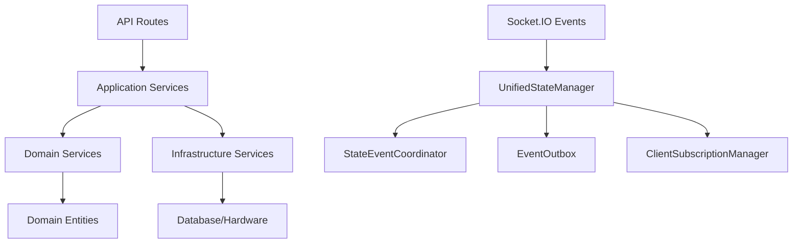
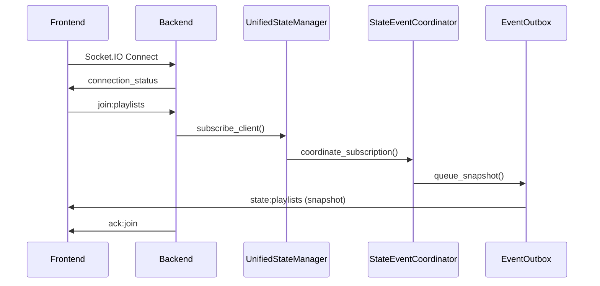
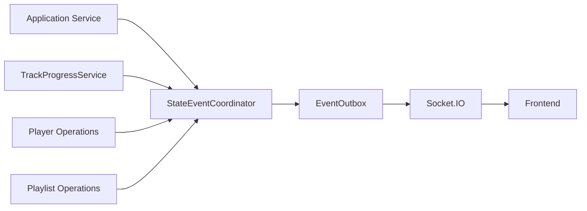
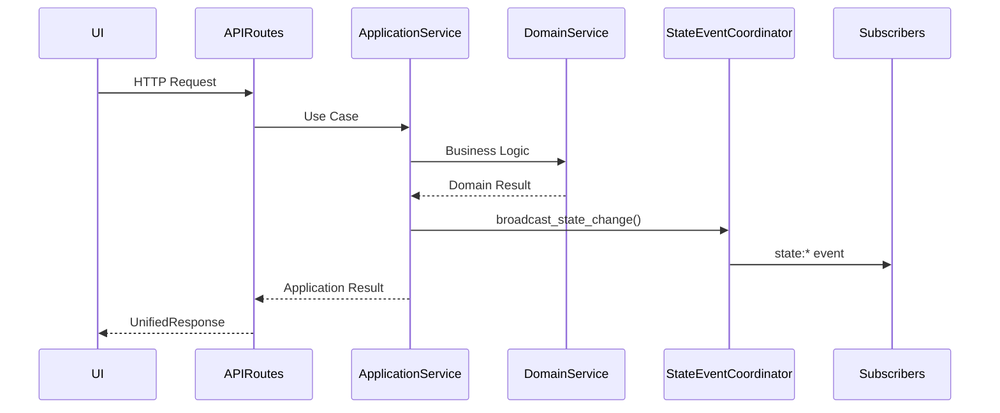
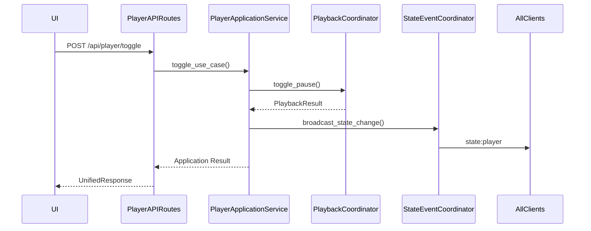
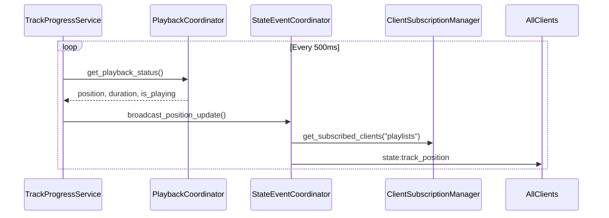

# TheOpenMusicBox: HTTP API & Socket.IO Communication (DDD Architecture v3.0)

This document specifies the HTTP API and Socket.IO communication as currently implemented with Domain-Driven Design architecture, server-authoritative patterns, and the UnifiedStateManager system.

## Table of Contents

- [Architecture Overview](#architecture-overview)
- [Domain-Driven Design Implementation](#domain-driven-design-implementation)
- [HTTP API Endpoints](#http-api-endpoints)
- [Socket.IO Communication](#socketio-communication)
- [State Management Architecture](#state-management-architecture)
- [Data Flow Patterns](#data-flow-patterns)
- [Authentication & Security](#authentication--security)
- [Error Handling](#error-handling)
- [Performance Considerations](#performance-considerations)
- [Configuration](#configuration)
- [Migration Notes](#migration-notes)

## Architecture Overview

TheOpenMusicBox uses a **Domain-Driven Design (DDD) Server-Authoritative Architecture** where:

- **Backend (FastAPI + DDD)**: Single source of truth with clean architecture separation
- **Frontend (Vue.js)**: Reactive client that subscribes to real-time updates
- **Socket.IO**: Real-time bidirectional communication for state updates
- **HTTP REST API**: Traditional request/response for operations via application services

### Technology Stack

| Component | Technology | Purpose |
|-----------|------------|---------|
| Backend Framework | FastAPI + DDD Architecture | HTTP API server with domain separation |
| WebSocket Server | Socket.IO (Python) | Real-time communication |
| State Management | UnifiedStateManager + DDD Services | Server-authoritative state coordination |
| Frontend Framework | Vue.js 3 + TypeScript | Reactive UI |
| WebSocket Client | Socket.IO (JavaScript) | Real-time updates |
| HTTP Client | Axios | API requests |

### DDD Architecture Layers



## Domain-Driven Design Implementation

### Application Services Layer

The application layer orchestrates domain operations and coordinates infrastructure concerns:

| Service | Purpose | Location |
|---------|---------|----------|
| `PlaylistApplicationService` | Playlist CRUD operations | `app/src/application/services/` |
| `PlayerApplicationService` | Player control operations | `app/src/application/services/` |
| `NfcApplicationService` | NFC tag management | `app/src/application/services/` |
| `UploadApplicationService` | File upload workflows | `app/src/application/services/` |

### Domain Services Layer

Pure business logic without infrastructure dependencies:

| Service | Purpose | Location |
|---------|---------|----------|
| `PlaybackStateManager` | Playback state business rules | `app/src/domain/services/` |
| `TrackProgressService` | Position tracking logic | `app/src/services/` |

### Infrastructure Layer

External system adapters and technical implementations:

| Component | Purpose | Location |
|-----------|---------|----------|
| Repository Adapters | Database abstraction | `app/src/infrastructure/repositories/` |
| Hardware Adapters | NFC/Audio hardware | `app/src/infrastructure/hardware/` |
| Error Handlers | Unified error handling | `app/src/infrastructure/error_handling/` |

## HTTP API Endpoints

### Core Endpoint Structure

The current implementation uses **clean DDD API routes** with the following structure:

```
/api/
├── playlists/           # Playlist management (DDD)
├── player/              # Player control (DDD)
├── nfc/                 # NFC operations (Unified)
├── uploads/             # Upload management
├── youtube/             # YouTube integration
└── system/              # System management
```

### Player Control API (DDD Implementation)

| Method | Endpoint | Description | Request Body | Response |
|--------|----------|-------------|--------------|----------|
| `POST` | `/api/player/play` | Start/resume playback | `PlayerControlRequest` | `UnifiedResponse<PlayerState>` |
| `POST` | `/api/player/pause` | Pause playback | `PlayerControlRequest` | `UnifiedResponse<PlayerState>` |
| `POST` | `/api/player/stop` | Stop playback | `PlayerControlRequest` | `UnifiedResponse<PlayerState>` |
| `POST` | `/api/player/toggle` | Toggle play/pause | `PlayerControlRequest` | `UnifiedResponse<PlayerState>` |
| `POST` | `/api/player/next` | Next track | `PlayerControlRequest` | `UnifiedResponse<PlayerState>` |
| `POST` | `/api/player/previous` | Previous track | `PlayerControlRequest` | `UnifiedResponse<PlayerState>` |
| `GET` | `/api/player/status` | Get player status | - | `UnifiedResponse<PlayerState>` |
| `POST` | `/api/player/seek` | Seek to position | `SeekRequest` | `UnifiedResponse<PlayerState>` |
| `POST` | `/api/player/volume` | Set volume level | `VolumeRequest` | `UnifiedResponse<VolumeState>` |

### Playlist Management API (DDD Implementation)

| Method | Endpoint | Description | Request Body | Response |
|--------|----------|-------------|--------------|----------|
| `GET` | `/api/playlists` | List playlists (paginated) | - | `UnifiedResponse<PlaylistCollection>` |
| `POST` | `/api/playlists` | Create playlist | `CreatePlaylistRequest` | `UnifiedResponse<Playlist>` |
| `GET` | `/api/playlists/{id}` | Get specific playlist | - | `UnifiedResponse<Playlist>` |
| `PUT` | `/api/playlists/{id}` | Update playlist | `UpdatePlaylistRequest` | `UnifiedResponse<Playlist>` |
| `DELETE` | `/api/playlists/{id}` | Delete playlist | `ClientOperationRequest` | `204 No Content` |
| `POST` | `/api/playlists/{id}/start` | Start playlist playback | `ClientOperationRequest` | `UnifiedResponse<PlayerState>` |
| `POST` | `/api/playlists/{id}/reorder` | Reorder tracks | `ReorderTracksRequest` | `UnifiedResponse<Success>` |
| `DELETE` | `/api/playlists/{id}/tracks` | Delete tracks | `DeleteTracksRequest` | `UnifiedResponse<Success>` |
| `POST` | `/api/playlists/move-track` | Move track between playlists | `MoveTrackRequest` | `UnifiedResponse<Success>` |
| `POST` | `/api/playlists/sync` | Synchronize playlists and broadcast state | - | `UnifiedResponse<SyncResult>` |

### NFC API (Unified Implementation)

| Method | Endpoint | Description | Request Body | Response |
|--------|----------|-------------|--------------|----------|
| `POST` | `/api/nfc/associate` | Associate tag with playlist | `NFCAssociateRequest` | `UnifiedResponse<NFCAssociation>` |
| `DELETE` | `/api/nfc/associate/{tag_id}` | Remove tag association | `ClientOperationRequest` | `UnifiedResponse<Success>` |
| `GET` | `/api/nfc/status` | Get NFC reader status | - | `UnifiedResponse<NFCStatusResponse>` |
| `POST` | `/api/nfc/scan` | Start NFC scan session | `NFCScanRequest` | `UnifiedResponse<NFCScanResponse>` |
| `DELETE` | `/api/nfc/session/{session_id}` | Cancel active association session | `ClientOperationRequest` | `UnifiedResponse<Success>` |

### Upload Management API

#### Playlist-Specific Upload Endpoints

| Method | Endpoint | Description | Request Body | Response |
|--------|----------|-------------|--------------|----------|
| `POST` | `/api/playlists/{id}/uploads/session` | Initialize upload session | `InitUploadRequest` | `UnifiedResponse<UploadSession>` |
| `PUT` | `/api/playlists/{id}/uploads/{session_id}/chunks/{chunk_index}` | Upload file chunk | `bytes (binary data)` | `UnifiedResponse<UploadProgress>` |
| `POST` | `/api/playlists/{id}/uploads/{session_id}/finalize` | Finalize upload | `FinalizeUploadRequest` | `UnifiedResponse<Track>` |
| `GET` | `/api/playlists/{id}/uploads/{session_id}` | Get upload status | - | `UnifiedResponse<UploadStatus>` |

#### Global Upload Session Management

| Method | Endpoint | Description | Request Body | Response |
|--------|----------|-------------|--------------|----------|
| `GET` | `/api/uploads/sessions` | List all upload sessions (with filtering) | `status` (query param) | `UnifiedResponse<UploadSessionCollection>` |
| `DELETE` | `/api/uploads/sessions/{session_id}` | Delete/cancel upload session | - | `UnifiedResponse<Success>` |
| `POST` | `/api/uploads/cleanup` | Cleanup stale sessions | `max_age_hours` (query param) | `UnifiedResponse<CleanupResult>` |

### YouTube Integration API

| Method | Endpoint | Description | Request Body | Response |
|--------|----------|-------------|--------------|----------|
| `POST` | `/api/youtube/download` | Download from YouTube URL | `YouTubeDownloadRequest` | `UnifiedResponse<DownloadTask>` |
| `GET` | `/api/youtube/status/{task_id}` | Get download progress | - | `UnifiedResponse<YouTubeProgress>` |
| `GET` | `/api/youtube/search` | Search YouTube videos | `query`, `max_results` | `UnifiedResponse<YouTubeResults>` |

### System Management API

| Method | Endpoint | Description | Response |
|--------|----------|-------------|----------|
| `GET` | `/api/system/info` | Get system information | `UnifiedResponse<SystemInfo>` |
| `GET` | `/api/system/logs` | Get system logs | `UnifiedResponse<LogCollection>` |
| `POST` | `/api/system/restart` | Restart system | `UnifiedResponse<Success>` |
| `GET` | `/api/health` | Health check endpoint | `UnifiedResponse<HealthStatus>` |
| `GET` | `/api/playback/status` | Get playback status (anti-cache) | `UnifiedResponse<PlayerState>` |

### Unified Response Format

All API endpoints use the `UnifiedResponseService` for consistent formatting:

```typescript
interface UnifiedResponse<T> {
  status: "success" | "error";
  message: string;
  data?: T;
  client_op_id?: string;
  server_seq?: number;
  timestamp: number;
  request_id?: string;
  error_type?: string;
  details?: any;
}
```

### Request Models

Additional request models for new endpoints:

```typescript
interface MoveTrackRequest {
  source_playlist_id: string;
  target_playlist_id: string;
  track_number: number;
  target_position?: number;
  client_op_id?: string;
}

interface ClientOperationRequest {
  client_op_id?: string;
}
```

## Socket.IO Communication

### Event Architecture

The current implementation uses **UnifiedStateManager** with clean DDD architecture:



### Event Categories and Implementation

#### 1. Connection Management

| Event | Direction | Payload | Current Implementation |
|-------|-----------|---------|----------------------|
| `connect` | Client → Server | - | `websocket_handlers_state.py:connect()` |
| `disconnect` | Client → Server | - | `websocket_handlers_state.py:disconnect()` |
| `connection_status` | Server → Client | `{status, sid, server_seq}` | ✅ Implemented |
| `client_ping` | Client → Server | `{}` | ✅ Implemented |
| `client_pong` | Server → Client | `{timestamp, server_time, server_seq}` | ✅ Implemented |

#### 2. Subscription Management

| Event | Direction | Payload | Current Implementation |
|-------|-----------|---------|----------------------|
| `join:playlists` | Client → Server | `{}` | ✅ DDD StateManager integration |
| `join:playlist` | Client → Server | `{playlist_id}` | ✅ DDD StateManager integration |
| `join:nfc` | Client → Server | `{assoc_id}` | ✅ NFC service integration |
| `leave:playlists` | Client → Server | `{}` | ✅ DDD StateManager integration |
| `leave:playlist` | Client → Server | `{playlist_id}` | ✅ DDD StateManager integration |
| `ack:join` | Server → Client | `{room, success, server_seq}` | ✅ Implemented |
| `ack:leave` | Server → Client | `{room, success}` | ✅ Implemented |

#### 3. State Events (DDD Implementation)

All state events use the **StateEventCoordinator** with proper envelope format:

| Event | Purpose | Envelope Structure | Frequency |
|-------|---------|-------------------|-----------|
| `state:player` | Player state updates | `{event_type, server_seq, data: PlayerState, timestamp, event_id}` | On demand |
| `state:track_position` | **Lightweight position tracking** | `{event_type, server_seq, data: {position_ms, track_id, is_playing}, timestamp, event_id}` | **500ms intervals** |
| `state:playlists` | Playlist collection updates | `{event_type, server_seq, data: {playlists: PlaylistLite[]}, timestamp, event_id}` | On demand |
| `state:playlist` | Specific playlist updates | `{event_type, server_seq, playlist_id, data: Playlist, timestamp, event_id}` | On demand |
| `state:track` | Track-level changes | `{event_type, server_seq, playlist_id, data: Track, timestamp, event_id}` | On demand |

#### 4. NFC Events (Unified Implementation)

| Event | Direction | Payload | Current Implementation |
|-------|-----------|---------|----------------------|
| `nfc_status` | Server → Client | `{assoc_id, state, playlist_id, tag_id?, server_seq}` | ✅ UnifiedNFCRoutes |
| `nfc_association_state` | Server → Client | `{state, playlist_id, tag_id?, message?, expires_at?, existing_playlist?, server_seq}` | ✅ Frontend-friendly format with tag tracking |
| `start_nfc_link` | Client → Server | `{playlist_id, client_op_id?}` | ✅ WebSocket handler |
| `stop_nfc_link` | Client → Server | `{playlist_id, client_op_id?}` | ✅ WebSocket handler |
| `override_nfc_tag` | Client → Server | `{playlist_id, tag_id?, client_op_id?}` | ✅ WebSocket handler with automatic tag processing |

**NFC Association States:**
- `waiting` - Waiting for tag scan (initial state)
- `duplicate` - Tag already associated with another playlist (includes `tag_id` and `existing_playlist`)
- `success` - Association completed successfully
- `timeout` - Session expired without tag detection
- `cancelled` - User cancelled the association
- `error` - Error occurred during association

**Override Mechanism (tag_id parameter):**
When `override_nfc_tag` is called with `tag_id` parameter:
1. Backend starts override session with `override_mode=true`
2. Tag is **automatically processed** without requiring second scan
3. Frontend receives `success` state immediately
4. Previous association is replaced atomically

This eliminates the need to scan the tag twice when overriding existing associations.

#### 5. Upload Progress Events

| Event | Direction | Payload | Current Implementation |
|-------|-----------|---------|----------------------|
| `upload:progress` | Server → Client | `{playlist_id, session_id, progress, complete}` | ✅ UploadController integration |
| `upload:complete` | Server → Client | `{playlist_id, session_id, track}` | ✅ UploadController integration |
| `upload:error` | Server → Client | `{playlist_id, session_id, error}` | ✅ UploadController integration |

#### 6. YouTube Events

| Event | Direction | Payload | Current Implementation |
|-------|-----------|---------|----------------------|
| `youtube:progress` | Server → Client | `{task_id, status, progress_percent?, current_step?}` | ✅ YouTubeRoutes |
| `youtube:complete` | Server → Client | `{task_id, track, playlist_id}` | ✅ YouTubeRoutes |
| `youtube:error` | Server → Client | `{task_id, message}` | ✅ YouTubeRoutes |

#### 7. Synchronization Events

| Event | Direction | Payload | Current Implementation |
|-------|-----------|---------|----------------------|
| `sync:request` | Client → Server | `{last_global_seq?, last_playlist_seqs?, requested_rooms?}` | ✅ DDD StateManager |
| `sync:complete` | Server → Client | `{synced_rooms, server_seq}` | ✅ DDD StateManager |
| `sync:error` | Server → Client | `{error, requested_rooms?}` | ✅ DDD StateManager |
| `client:request_current_state` | Client → Server | `{}` | ✅ Immediate state sync |

#### 8. Operation Acknowledgments

| Event | Direction | Payload | Current Implementation |
|-------|-----------|---------|----------------------|
| `ack:op` | Server → Client | `{client_op_id, success: true, data?, server_seq}` | ✅ StateEventCoordinator |
| `err:op` | Server → Client | `{client_op_id, success: false, message, server_seq}` | ✅ StateEventCoordinator |

#### 9. Health and Monitoring Events

| Event | Direction | Payload | Current Implementation |
|-------|-----------|---------|----------------------|
| `client_ping` | Client → Server | `{timestamp?}` | ✅ Connection health check |
| `client_pong` | Server → Client | `{timestamp, server_time, server_seq}` | ✅ Ping response |
| `health_check` | Client → Server | `{}` | ✅ System health request |
| `health_status` | Server → Client | `{health_metrics, connected_clients, server_time}` | ✅ Health metrics response |

#### 10. Post-Connection State Synchronization

**Critical Events for Page Refresh and Reconnection:**

| Event | Direction | Purpose | When Used |
|-------|-----------|---------|-----------|
| `client:request_current_state` | Client → Server | Request immediate full player state | After page refresh or reconnection |
| `state:player` (response) | Server → Client | Complete current player state | Response to state request |

**Reconnection Flow Pattern:**
```javascript
// Frontend reconnection after page refresh
socket.on('connect', () => {
  // 1. Join necessary rooms
  socket.emit('join:playlists', {});

  // 2. CRITICAL: Request immediate current state
  socket.emit('client:request_current_state', {});
});

// Server responds with complete player state
socket.on('state:player', (envelope) => {
  const { data } = envelope;
  // data contains complete PlayerState fields at top level
  // Update UI with current playback information
});
```

## State Management Architecture

### UnifiedStateManager (DDD Implementation)

The **UnifiedStateManager** coordinates multiple focused components following DDD principles:

```python
class UnifiedStateManager(StateManagerProtocol):
    def __init__(self, socketio_server=None):
        # Focused components (Single Responsibility Principle)
        self.sequences = SequenceGenerator()              # Thread-safe sequence generation
        self.outbox = EventOutbox(socketio_server)        # Reliable event delivery
        self.subscriptions = ClientSubscriptionManager()  # Room management
        self.operations = OperationTracker()              # Deduplication

        # DDD components
        self.state_manager = PlaybackStateManager()       # Domain state management
        self.event_coordinator = StateEventCoordinator()  # Event coordination
        self.serialization_service = StateSerializationApplicationService()
        self.snapshot_service = StateSnapshotApplicationService()
        self.lifecycle_service = StateManagerLifecycleApplicationService()
```

### Component Responsibilities

| Component | Single Responsibility | Location |
|-----------|----------------------|----------|
| **EventOutbox** | Reliable event delivery with retry logic | `app/src/services/event_outbox.py` |
| **ClientSubscriptionManager** | Room-based subscription management | `app/src/services/client_subscription_manager.py` |
| **SequenceGenerator** | Thread-safe sequence number generation | `app/src/services/sequence_generator.py` |
| **OperationTracker** | Operation deduplication and result caching | `app/src/services/operation_tracker.py` |
| **StateEventCoordinator** | Event coordination between domain and transport | `app/src/application/services/state_event_coordinator.py` |
| **PlaybackStateManager** | Domain state management and business rules | `app/src/domain/services/playback_state_manager.py` |

### High-Frequency Position Updates

The system implements **optimized position tracking** for smooth playback:

```python
# Configuration from socket_config.py
POSITION_UPDATE_INTERVAL_MS = 500    # 500ms updates for smooth progression
POSITION_THROTTLE_MIN_MS = 400       # Minimum time between updates

# Implementation in StateEventCoordinator
async def broadcast_position_update(
    self,
    position_ms: int,
    track_id: str,
    is_playing: bool,
    duration_ms: Optional[int] = None
) -> Optional[dict]:
    """Broadcast lightweight position update with throttling."""
```

### Event Flow Architecture



## Data Flow Patterns

### 1. CRUD Operations (DDD Flow)



### 2. Player Control (DDD Flow)



### 3. Real-time Position Updates



## Authentication & Security

### Current Implementation

- **No Authentication**: System designed for local network use
- **CORS Configuration**: Configurable allowed origins via environment
- **Rate Limiting**: Implemented via `OperationsService` in DDD routes
- **Input Validation**: Pydantic models with `UnifiedValidationService`
- **Error Handling**: Unified error handling with `UnifiedErrorHandler`

### Security Measures

```python
# Rate limiting in DDD implementation
class PlayerAPIRoutes:
    async def play_player(self, request: Request, body: PlayerControlRequest):
        # Rate limiting via operations service
        if self._operations_service:
            rate_check = await self._operations_service.check_rate_limit_use_case(request)
            if not rate_check.get("allowed", True):
                return UnifiedResponseService.error(
                    message="Too many requests",
                    error_type="rate_limit_error",
                    status_code=429
                )
```

### Rate Limiting Configuration

| Endpoint Category | Implementation | Rationale |
|------------------|----------------|-----------|
| Player Control | Operations Service | Prevent rapid-fire commands |
| File Uploads | Upload Controller | Limit concurrent uploads |
| YouTube Downloads | YouTube Service | Prevent API abuse |

## Error Handling

### Unified Error Response Format (DDD Implementation)

All endpoints use `UnifiedResponseService` for consistent error handling:

```typescript
interface ErrorResponse {
  status: "error";
  message: string;
  error_type: "validation_error" | "not_found" | "rate_limit_exceeded" |
             "service_unavailable" | "internal_error" | "conflict" | "bad_request";
  details?: any;
  timestamp: number;
  request_id?: string;
  client_op_id?: string;
}
```

### Error Types & Status Codes

| Error Type | HTTP Status | Usage | Implementation |
|------------|-------------|-------|----------------|
| `validation_error` | 400 | Invalid request data | `UnifiedValidationService` |
| `bad_request` | 400 | Invalid operation parameters | Application Services |
| `not_found` | 404 | Resource not found | Repository layer |
| `conflict` | 409 | Resource conflict | Domain validation |
| `rate_limit_exceeded` | 429 | Too many requests | Operations Service |
| `service_unavailable` | 503 | Backend service unavailable | Infrastructure layer |
| `internal_error` | 500 | Unexpected server error | Unified Error Handler |

### Socket.IO Error Handling

```typescript
// Frontend error handling for operations
socket.on('err:op', (data) => {
  const { client_op_id, message, server_seq } = data;
  // Handle operation failure
});

socket.on('ack:op', (data) => {
  const { client_op_id, success, data: payload, server_seq } = data;
  // Handle operation success
});
```

## Performance Considerations

### Backend Optimizations (DDD Implementation)

1. **Component Separation**: Single-responsibility components for maintainability
2. **Async/Await**: Non-blocking I/O throughout DDD services
3. **Connection Pooling**: Managed via infrastructure layer
4. **Event Throttling**: Position events throttled to 500ms intervals
5. **Sequence Management**: Thread-safe atomic operations via `SequenceGenerator`
6. **Memory Management**: Outbox cleanup and operation result TTL

### Socket.IO Performance Configuration

```python
# Current socket_config.py settings
class SocketConfig:
    POSITION_UPDATE_INTERVAL_MS = 500      # Smooth UI updates
    POSITION_THROTTLE_MIN_MS = 400         # Prevent flooding
    OUTBOX_RETRY_MAX = 3                   # Retry attempts
    OUTBOX_SIZE_LIMIT = 1000               # Memory management
    OPERATION_DEDUP_WINDOW_SEC = 300       # 5 minute deduplication
```

### Performance Metrics

| Metric | Current Target | Implementation |
|--------|----------------|----------------|
| API Response Time | < 200ms | DDD Application Services |
| Socket Latency | < 50ms | EventOutbox with retry |
| Position Update Frequency | 500ms | TrackProgressService |
| Memory Usage | < 100MB | Component cleanup |
| Event Processing | < 10ms | StateEventCoordinator |

## Configuration

### Socket Configuration (Current Implementation)

```python
# app/src/config/socket_config.py
@dataclass
class SocketConfig:
    # Position update timing
    POSITION_UPDATE_INTERVAL_MS: int = 500
    POSITION_THROTTLE_MIN_MS: int = 400

    # Outbox configuration
    OUTBOX_RETRY_MAX: int = 3
    OUTBOX_SIZE_LIMIT: int = 1000

    # Operation deduplication
    OPERATION_DEDUP_WINDOW_SEC: int = 300
    OPERATION_RESULT_TTL_SEC: int = 600

    # Client management
    CLIENT_TIMEOUT_SEC: int = 60

    # Performance optimization
    COMPRESS_PAYLOADS_OVER_BYTES: int = 1024
    MAX_EVENT_BATCH_SIZE: int = 50
```

### Application Configuration

The application uses environment-based configuration with DDD bootstrap:

```python
# main.py initialization sequence
1. Database initialization with health checks
2. Domain bootstrap initialization
3. DDD application services registration
4. API routes registration (DDD)
5. Socket.IO handlers registration
6. Background services startup (TrackProgressService)
7. Infrastructure services (Hardware, NFC)
```

## Migration Notes

### From Legacy to DDD Architecture

The current implementation represents a **complete DDD evolution** from the original documented architecture:

#### **Legacy Architecture (Documented v2.0):**
- Direct StateManager
- Mixed route handlers
- Simple event broadcasting

#### **Current Architecture (DDD v3.0):**
- UnifiedStateManager with component delegation
- Clean DDD application services
- StateEventCoordinator with reliable delivery
- Protocol-based design with dependency inversion

#### **Compatibility Maintained:**
- Socket.IO events are 100% backward compatible
- API contracts maintained through `UnifiedResponseService`
- Client operation IDs supported throughout

#### **Enhanced Features:**
- **Better Error Handling**: Unified error responses
- **Improved Performance**: Component-based throttling and caching
- **Better Testability**: Clear component boundaries
- **Enhanced Reliability**: EventOutbox with retry mechanisms
- **Cleaner Architecture**: Single Responsibility Principle throughout

### Breaking Changes

**None** - The DDD implementation maintains full backward compatibility while providing enhanced functionality and better architecture.

---

*This documentation reflects the current Domain-Driven Design implementation (v3.0) with UnifiedStateManager, clean component separation, and enhanced reliability patterns. All Socket.IO events and API contracts remain backward compatible while providing superior performance and maintainability.*