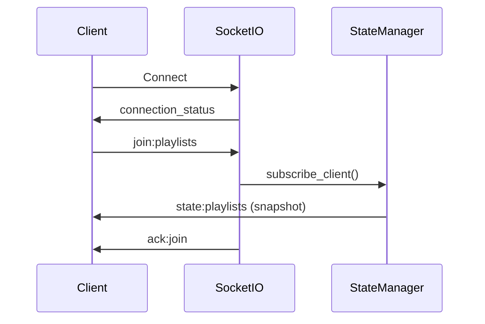

# WebSocket Events - The Open Music Box

## Overview

The Open Music Box uses Socket.IO for real-time communication between the backend and frontend clients. This event-driven architecture enables live synchronization of player state, playlist updates, and progress tracking across all connected devices.

## Connection Architecture

### Initial Connection Flow


### Configuration

```javascript
// Client-side configuration
const socketConfig = {
  url: process.env.VUE_APP_SOCKET_URL,
  options: {
    autoConnect: true,
    reconnection: true,
    reconnectionAttempts: 5,
    reconnectionDelay: 1000,
    reconnectionDelayMax: 5000,
    timeout: 20000,
    transports: ['websocket', 'polling']
  }
}
```

## Event Categories

### 1. Connection Management

#### `connect`
**Direction:** Client → Server
**Purpose:** Establish WebSocket connection
**Payload:** None

#### `disconnect`
**Direction:** Bidirectional
**Purpose:** Close connection
**Payload:** None

#### `connection_status`
**Direction:** Server → Client
**Purpose:** Connection acknowledgment with server info
**Payload:**
```json
{
  "status": "connected",
  "sid": "socket-session-id",
  "server_seq": 12345,
  "server_time": 1640995200000
}
```

#### `client_ping` / `client_pong`
**Direction:** Bidirectional
**Purpose:** Connection health monitoring
**Payload:** `{}`

### 2. Room Subscription Management

#### `join:playlists`
**Direction:** Client → Server
**Purpose:** Subscribe to global playlist updates
**Payload:** `{}`

#### `join:playlist`
**Direction:** Client → Server
**Purpose:** Subscribe to specific playlist updates
**Payload:**
```json
{
  "playlist_id": "playlist-uuid"
}
```

#### `join:nfc`
**Direction:** Client → Server
**Purpose:** Subscribe to NFC association events
**Payload:** `{}`

#### `leave:playlists` / `leave:playlist`
**Direction:** Client → Server
**Purpose:** Unsubscribe from updates
**Payload:**
```json
{
  "playlist_id": "playlist-uuid" // for leave:playlist only
}
```

#### `ack:join` / `ack:leave`
**Direction:** Server → Client
**Purpose:** Subscription confirmation
**Payload:**
```json
{
  "room": "playlists",
  "success": true,
  "server_seq": 12345,
  "playlist_seq": 678, // for playlist-specific rooms
  "message": "Successfully joined room"
}
```

### 3. State Synchronization Events

All state events follow a standardized envelope format:

```json
{
  "event_type": "state:player",
  "server_seq": 12345,
  "playlist_id": "optional-playlist-uuid",
  "data": {/* Event payload */},
  "timestamp": 1640995200000,
  "event_id": "unique-event-id"
}
```

#### `state:player`
**Direction:** Server → Client
**Purpose:** Complete player state updates
**Room:** `playlists`
**Data Payload:** Complete `PlayerState` object

#### `state:track_position`
**Direction:** Server → Client
**Purpose:** Lightweight position updates (200ms intervals)
**Room:** `playlists`
**Data Payload:**
```json
{
  "position_ms": 45000,
  "track_id": "current-track-uuid",
  "is_playing": true,
  "duration_ms": 180000 // optional
}
```

#### `state:playlists`
**Direction:** Server → Client
**Purpose:** Playlist collection updates
**Room:** `playlists`
**Data Payload:**
```json
{
  "playlists": [/* Array of PlaylistLite objects */]
}
```

#### `state:playlist`
**Direction:** Server → Client
**Purpose:** Specific playlist updates
**Room:** `playlist:{id}`
**Data Payload:** Complete `Playlist` object with tracks

#### `state:track`
**Direction:** Server → Client
**Purpose:** Individual track changes
**Room:** `playlist:{id}`
**Data Payload:** Complete `Track` object

### 4. Operation Acknowledgments

#### `ack:op`
**Direction:** Server → Client
**Purpose:** Operation success confirmation
**Payload:**
```json
{
  "client_op_id": "operation-uuid",
  "success": true,
  "data": {/* Operation result */},
  "server_seq": 12345
}
```

#### `err:op`
**Direction:** Server → Client
**Purpose:** Operation failure notification
**Payload:**
```json
{
  "client_op_id": "operation-uuid",
  "success": false,
  "message": "Error description",
  "error_type": "validation_error",
  "server_seq": 12345
}
```

### 5. File Upload Progress

#### `upload:progress`
**Direction:** Server → Client
**Purpose:** Real-time upload progress
**Payload:**
```json
{
  "playlist_id": "target-playlist-uuid",
  "session_id": "upload-session-uuid",
  "chunk_index": 3,
  "progress": 60.5,
  "complete": false
}
```

#### `upload:complete`
**Direction:** Server → Client
**Purpose:** Upload completion notification
**Payload:**
```json
{
  "playlist_id": "target-playlist-uuid",
  "session_id": "upload-session-uuid",
  "filename": "song.mp3",
  "metadata": {/* File metadata */},
  "track": {/* Complete Track object */}
}
```

#### `upload:error`
**Direction:** Server → Client
**Purpose:** Upload failure notification
**Payload:**
```json
{
  "playlist_id": "target-playlist-uuid",
  "session_id": "upload-session-uuid",
  "error": "Upload failed: disk full"
}
```

### 6. NFC Association Events

#### `nfc_status`
**Direction:** Server → Client
**Purpose:** NFC association session status
**Payload:**
```json
{
  "assoc_id": "association-uuid",
  "state": "listening", // listening|duplicate|success|stopped|timeout|error
  "playlist_id": "target-playlist-uuid",
  "tag_id": "detected-tag-id",
  "conflict_playlist_id": "existing-playlist-uuid", // if duplicate
  "started_at": "2025-01-01T12:00:00Z",
  "timeout_at": "2025-01-01T12:01:00Z",
  "server_seq": 12345
}
```

#### `nfc_association_state`
**Direction:** Server → Client
**Purpose:** User-friendly association updates
**Payload:**
```json
{
  "state": "listening",
  "playlist_id": "target-playlist-uuid",
  "tag_id": "detected-tag-id",
  "message": "Scan an NFC tag to associate with this playlist",
  "expires_at": "2025-01-01T12:01:00Z",
  "existing_playlist": {
    "id": "conflicting-playlist-uuid",
    "title": "Already Associated Playlist"
  },
  "server_seq": 12345
}
```

#### NFC Client Actions
```javascript
// Start association process
socket.emit('start_nfc_link', {
  playlist_id: 'target-playlist-uuid',
  timeout_s: 60
});

// Stop association process
socket.emit('stop_nfc_link', {
  assoc_id: 'association-uuid'
});

// Override existing association
socket.emit('override_nfc_tag', {
  tag_id: 'nfc-tag-id',
  playlist_id: 'new-playlist-uuid',
  force: true
});
```

### 7. YouTube Download Events

#### `youtube:progress`
**Direction:** Server → Client
**Purpose:** Download progress updates
**Payload:**
```json
{
  "task_id": "download-task-uuid",
  "status": "downloading", // pending|downloading|processing|completed|error
  "progress_percent": 75.5,
  "current_step": "Converting audio format",
  "estimated_time_remaining": 30000
}
```

#### `youtube:complete`
**Direction:** Server → Client
**Purpose:** Download completion
**Payload:**
```json
{
  "task_id": "download-task-uuid",
  "track": {/* Complete Track object */},
  "playlist_id": "target-playlist-uuid"
}
```

#### `youtube:error`
**Direction:** Server → Client
**Purpose:** Download failure
**Payload:**
```json
{
  "task_id": "download-task-uuid",
  "message": "Download failed: video unavailable"
}
```

### 8. System Health & Monitoring

#### `health_check`
**Direction:** Client → Server
**Purpose:** Request system status
**Payload:** `{}`

#### `health_status`
**Direction:** Server → Client
**Purpose:** System health information
**Payload:**
```json
{
  "status": "healthy",
  "components": {
    "database": "connected",
    "audio": "available",
    "nfc": "available"
  },
  "timestamp": 1640995200000
}
```

#### `health_error`
**Direction:** Server → Client
**Purpose:** System health issues
**Payload:**
```json
{
  "error": "Audio backend unavailable",
  "component": "audio",
  "timestamp": 1640995200000
}
```

### 9. State Synchronization

#### `sync:request`
**Direction:** Client → Server
**Purpose:** Request missed events or full state
**Payload:**
```json
{
  "last_global_seq": 12340,
  "last_playlist_seqs": {
    "playlist-uuid-1": 15,
    "playlist-uuid-2": 22
  },
  "requested_rooms": ["playlists", "playlist:uuid"]
}
```

#### `sync:complete`
**Direction:** Server → Client
**Purpose:** Synchronization completion
**Payload:**
```json
{
  "synced_rooms": ["playlists", "playlist:uuid"],
  "server_seq": 12345
}
```

#### `sync:error`
**Direction:** Server → Client
**Purpose:** Synchronization failure
**Payload:**
```json
{
  "error": "Sequence too old, full refresh required",
  "requested_rooms": ["playlists"]
}
```

#### `client:request_current_state`
**Direction:** Client → Server
**Purpose:** Request immediate current state
**Payload:** `{}`
**Note:** Triggers `state:player` emission to requesting client

## Room Management

### Room Structure
- **`playlists`**: Global playlist updates and player state
- **`playlist:{id}`**: Specific playlist and track updates
- **`nfc`**: NFC association events and status

### Subscription Patterns
```javascript
// Subscribe to multiple rooms
socket.emit('join:playlists');
socket.emit('join:playlist', { playlist_id: 'uuid' });
socket.emit('join:nfc');

// Automatic re-subscription on reconnect
socket.on('reconnect', () => {
  socket.emit('join:playlists');
  // Re-subscribe to previously joined rooms
});
```

## Error Recovery Patterns

### Automatic Reconnection
```javascript
socket.on('reconnect', () => {
  console.log('Reconnected to server');

  // Re-subscribe to rooms
  resubscribeToRooms();

  // Request state synchronization
  socket.emit('sync:request', {
    last_global_seq: lastKnownSequence
  });
});
```

### Event Replay
```javascript
// Handle missed events on reconnection
socket.on('sync:complete', () => {
  console.log('State synchronized successfully');
});

socket.on('sync:error', (data) => {
  console.error('Sync failed:', data.error);
  // Request full state refresh
  requestFullStateRefresh();
});
```

## Performance Optimization

### Event Throttling
- **Position updates**: Limited to 200ms intervals with 150ms minimum throttling
- **Progress events**: Batched to prevent UI flooding
- **Bulk operations**: Single events for multiple changes

### Client-Side Buffering
```javascript
// Buffer rapid state changes
const stateBuffer = new Map();
const BUFFER_DELAY = 50; // ms

function handleStateEvent(eventData) {
  stateBuffer.set(eventData.event_type, eventData);

  clearTimeout(bufferTimeout);
  bufferTimeout = setTimeout(flushStateBuffer, BUFFER_DELAY);
}
```

### Memory Management
- **Event cleanup**: Old events automatically pruned
- **Room cleanup**: Unused subscriptions cleaned up
- **Connection pooling**: Efficient server resource usage

This WebSocket event system provides reliable, real-time communication with comprehensive error recovery and performance optimization for a smooth user experience across all connected devices.