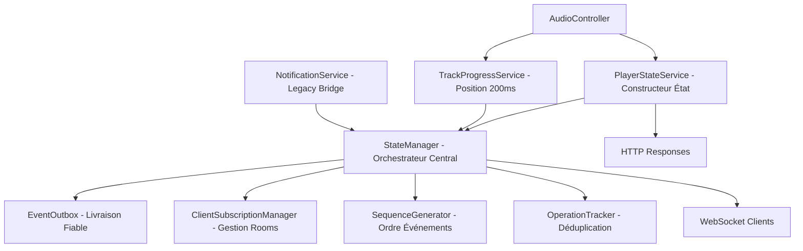
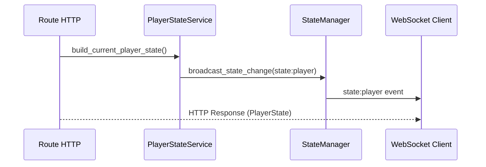
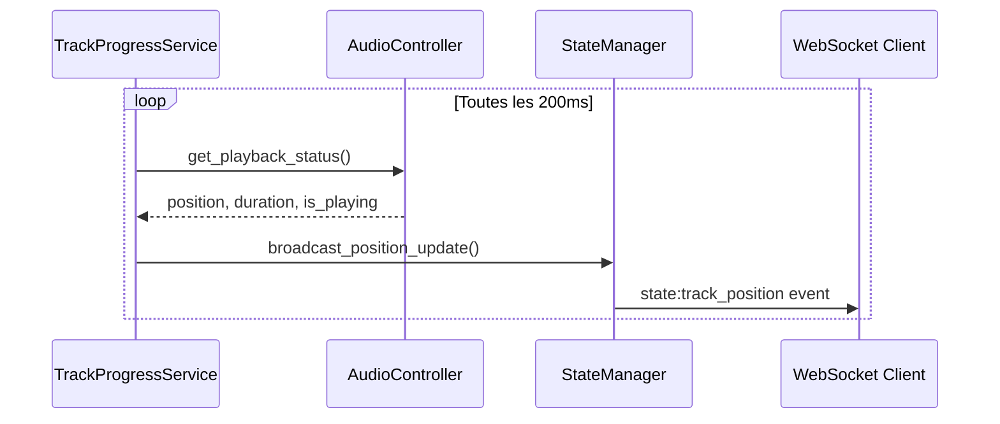
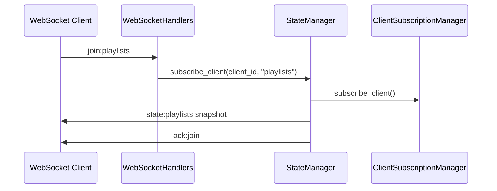

# Backend Services Architecture - TheOpenMusicBox

## Vue d'ensemble

TheOpenMusicBox utilise une **architecture Domain-Driven Design (DDD)** avec une approche **server-authoritative**. L'architecture sépare clairement les couches Application, Domaine et Infrastructure, avec 8 services coordonnés pour gérer l'état du player et les mises à jour temps réel.

## Architecture Générale



## Services Détaillés

### 1. StateManager - Orchestrateur Central ✅ ACTIF

**Fichier**: `app/src/services/state_manager.py`
**Classe**: `StateManager`

**Responsabilités**:
- Coordination centrale de tous les événements temps réel
- Diffusion WebSocket vers clients abonnés
- Gestion des salles ("playlists", "playlist:{id}")
- Interface unifiée pour broadcast d'état

**Méthodes clés**:
```python
async def broadcast_state_change(event_type, data, playlist_id=None)
async def broadcast_position_update(position_ms, track_id, is_playing)
async def subscribe_client(client_id, room)
```

**Composants internes**:
- **EventOutbox**: Livraison fiable avec retry
- **ClientSubscriptionManager**: Gestion abonnements clients
- **SequenceGenerator**: Numérotation séquentielle thread-safe
- **OperationTracker**: Prévention doublons

### 2. PlayerStateService - Constructeur d'État ✅ ACTIF

**Fichier**: `app/src/services/player_state_service.py`

**Responsabilités**:
- Construction d'objets PlayerState cohérents
- Interface unifiée entre AudioController et réponses API
- Normalisation des données player

**Méthodes clés**:
```python
async def build_current_player_state() -> PlayerState
async def build_track_progress_state() -> dict
async def broadcast_playlist_started(playlist_id)  # Legacy
```

**Usage**: Utilisé par toutes les routes player pour générer réponses HTTP standardisées.

### 3. TrackProgressService - Position Temps Réel ✅ ACTIF

**Fichier**: `app/src/services/track_progress_service.py`

**Responsabilités**:
- Émissions position toutes les 200ms pendant la lecture
- Mises à jour légères pour tracking fluide
- Throttling pour éviter spam (150ms minimum)
- Récupération d'erreur automatique

**Configuration**:
```python
POSITION_UPDATE_INTERVAL_MS = 200  # socket_config
POSITION_THROTTLE_MIN_MS = 150
```

**Flux de données**:
```
AudioController.get_playback_status() → position_ms, duration_ms, is_playing
→ StateManager.broadcast_position_update()
→ WebSocket state:track_position event
```

### 4. NotificationService - Service Transitionnel ⚠️️ PARTIELLEMENT ACTIF

**Fichier**: `app/src/services/notification_service.py`

**Composants**:

#### PlaybackSubject (Déprécié)
- **État**: Supprimé dans l'architecture DDD
- **Remplacement**: StateManager gère toutes les émissions
- **Migration**: Complètement migré vers StateManager

#### DownloadNotifier (Actif)
- **Usage**: Événements YouTube download
- **Émissions**: `youtube:progress`, `youtube:complete`, `youtube:error`

### 5-8. Composants Internes StateManager ✅ TOUS ACTIFS

#### ClientSubscriptionManager
```python
# Gestion abonnements WebSocket rooms
async def subscribe_client(client_id: str, room: str)
async def unsubscribe_client(client_id: str, room: str)
def get_subscribed_clients(room: str) -> Set[str]
```

#### EventOutbox
```python
# Livraison fiable avec retry
async def add_event(event_id, payload, target_room)
async def process_outbox()  # Retry failed emissions
```

#### SequenceGenerator
```python
# Numéros séquence thread-safe
async def get_next_global_seq() -> int
async def get_next_playlist_seq(playlist_id: str) -> int
```

#### OperationTracker
```python
# Prévention opérations dupliquées
def is_processed(client_op_id: str) -> bool
def mark_processed(client_op_id: str, result: any)
```

## Flux de Communication

### Événements Player State


### Position Updates Continus


### Abonnement Client


## Types d'Événements WebSocket

| Événement | Émetteur | Fréquence | Payload | Objectif |
|-----------|----------|-----------|---------|----------|
| `state:player` | StateManager | Sur demande | PlayerState complet | État complet player |
| `state:track_position` | TrackProgressService | 200ms | Position légère | Position fluide |
| `state:playlists` | StateManager | Sur demande | Collection playlists | Synchronisation listes |
| `youtube:progress` | DownloadNotifier | Continue | Progrès download | Feedback YouTube |

## Initialisation des Services

### Ordre de démarrage (Architecture DDD)
1. **main.py** → `Application.initialize_async()`
2. **DomainBootstrap** → Initialisation domaine
3. **Application Services** → Services applicatifs DDD
4. **StateManager** création avec composants internes
5. **TrackProgressService** planification démarrage background
6. **WebSocket handlers** enregistrement
7. **Infrastructure** → Services concrets (DB, Hardware)
8. Services prêts pour requêtes

### Configuration
```python
# app/src/config/socket_config.py - Configuration réelle
class SocketConfig:
    POSITION_UPDATE_INTERVAL_MS = 200
    POSITION_THROTTLE_MIN_MS = 150
    OUTBOX_RETRY_MAX = 3
    OUTBOX_SIZE_LIMIT = 1000
    OPERATION_DEDUP_WINDOW_SEC = 300
    CLIENT_TIMEOUT_SEC = 60
```

## Patterns Architecturaux

### Server-Authoritative
- **Source unique vérité**: Backend maintient état autoritaire
- **Clients abonnés**: Frontend s'abonne aux mises à jour
- **Séquençage**: Tous événements ont numéro séquence
- **Résolution conflits**: État serveur toujours prioritaire

### Event Sourcing
- **Envelope standardisée**: Tous événements suivent même format
- **Séquence globale**: Ordre chronologique garanti
- **Traçabilité**: event_id unique pour debugging
- **Replay**: Possibilité reconstituer état

### Reliability Patterns
- **Outbox Pattern**: Queue événements avec retry
- **Circuit Breaker**: Récupération erreur automatique
- **Throttling**: Prévention surcharge réseau
- **Deduplication**: Évite traitement multiple

## Métriques et Monitoring

### Statistiques disponibles
```python
# Méthode get_stats() disponible pour monitoring
# Structure exacte dépend de l'implémentation StateManager
```

### Logging
- **StateManager**: Événements non-position seulement (évite spam)
- **TrackProgressService**: Erreurs et récupération
- **Composants**: Statistiques périodiques

## Cohérence Frontend-Backend

### Événements WebSocket
- **Backend StateManager** → **Frontend socketService** → **serverStateStore**
- Format standardisé avec envelope et séquence
- Rooms appropriées pour efficacité

### Réponses HTTP
- **Backend PlayerStateService** → **Frontend apiService** → **UI Components**
- Structure PlayerState identique
- Gestion erreur cohérente

Cette architecture garantit une **communication temps réel fiable** avec **état cohérent** entre tous les clients et **performance optimale** via throttling intelligent.