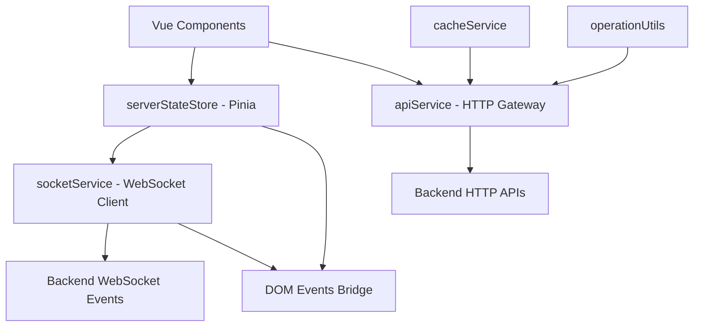
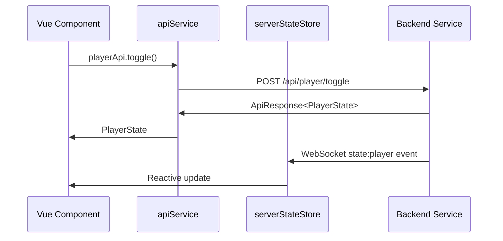
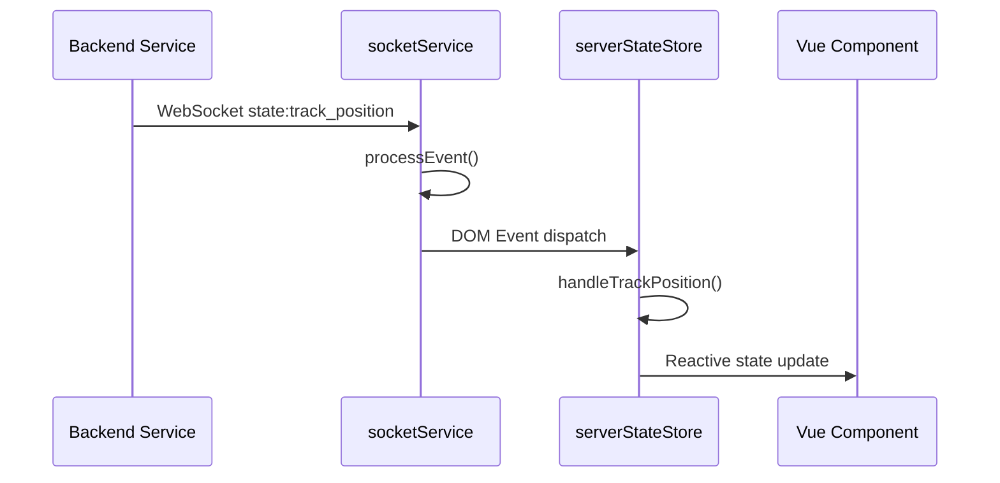
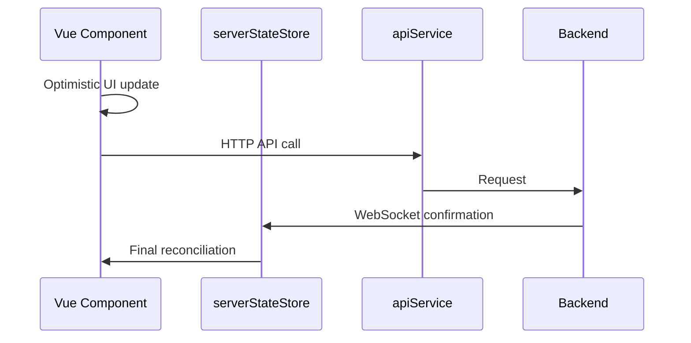

# Frontend Architecture - TheOpenMusicBox

## Vue d'ensemble

L'architecture frontend de TheOpenMusicBox suit un pattern **server-authoritative** avec synchronisation temps réel via WebSocket, intégration API HTTP complète, et composants Vue.js réactifs. Le backend sert de source unique de vérité, le frontend agissant comme couche présentation réactive.

## Architecture des Services

### Couche Service Principale



## Services Fondamentaux

### 1. serverStateStore.ts - Gestion d'État Centralisée ✅

**Architecture**: Store Pinia avec état server-authoritative  
**Fichier**: `front/src/stores/serverStateStore.ts`

**Responsabilités**:
- Source unique de vérité pour état serveur
- Synchronisation temps réel via WebSocket
- Déduplication opérations client
- Mises à jour optimistes avec réconciliation serveur

**Structure de données**:
```typescript
interface PlayerState {
  // Playback state
  is_playing: boolean;
  state: PlaybackState;
  
  // Current playlist/track
  active_playlist_id: string | null;
  active_playlist_title: string | null;
  active_track_id: string | null;
  active_track: Track | null;
  
  // Playback position
  position_ms: number;
  duration_ms: number;
  
  // Playlist navigation
  track_index: number;
  track_count: number;
  can_prev: boolean;
  can_next: boolean;
  
  // Audio control
  volume: number;
  muted: boolean;
  
  // System
  server_seq: number;
}
```

**Handlers événements**:
- `state:player` → État complet player
- `state:track_position` → Position légère 200ms  
- `state:playlists` → Collection playlists
- `ack:op` / `err:op` → Confirmations opérations

### 2. apiService.ts - Passerelle HTTP API ✅

**Architecture**: Gateway HTTP modulaire par domaine  
**Fichier**: `front/src/services/apiService.ts`

**Services spécialisés**:
- **playerApi**: Contrôle player (toggle, seek, volume)
- **playlistApi**: Gestion playlists CRUD + pagination
- **uploadApi**: Upload chunked avec progress  
- **systemApi**: Santé système et volume
- **nfcApi**: Gestion tags NFC et associations
- **youtubeApi**: Recherche et download YouTube

**Fonctionnalités**:
```typescript
// Gestion d'erreur standardisée
class StandardApiError extends Error {
  constructor(message: string, type: string, status: number) {
    this.type = type;
    this.status = status;
  }
}

// Extracteur réponse avec validation
class ApiResponseHandler {
  static extractData<T>(response: AxiosResponse<ApiResponse<T>>): T {
    return response.data.data!;
  }
}
```

### 3. socketService.ts - Communication WebSocket ✅

**Architecture**: Client WebSocket event-driven  
**Fichier**: `front/src/services/socketService.ts`

**Responsabilités**:
- Communication bidirectionnelle temps réel
- Abonnements rooms (playlists, playlist:id, nfc)
- Séquençage événements et buffering
- Reconnexion automatique avec re-abonnement

**Configuration**:
```typescript
// Configuration réelle dans environment.ts
const socketConfig = {
  autoConnect: true,
  transports: ['websocket', 'polling']
}
```

**Pattern événements**:
```typescript
// Réception événement serveur
private processEvent(envelope: StateEventEnvelope): void {
  this.emitLocal(envelope.event_type, envelope)
  
  // CRITIQUE: Bridge DOM pour serverStateStore
  window.dispatchEvent(new CustomEvent(envelope.event_type, { 
    detail: envelope 
  }))
}
```

## Dépendances Backend par Service

### HTTP API Dependencies

#### playerApi → Backend Player Routes
```typescript
// Endpoints consommés (routes réelles)
GET /api/player/status           // PlayerStateService
POST /api/player/toggle          // PlayerStateService + StateManager
POST /api/player/seek            // PlayerStateService + StateManager  
POST /api/player/volume          // PlayerStateService + StateManager
POST /api/player/stop            // PlayerStateService + StateManager
POST /api/player/next            // PlayerStateService + StateManager
POST /api/player/previous        // PlayerStateService + StateManager

// Réponses standardisées
ApiResponse<PlayerState> {
  status: "success",
  message: "...",
  data: PlayerState,
  server_seq: number
}
```

#### playlistApi → Backend Playlist Routes  
```typescript
// CRUD Operations
GET /api/playlists/              // PlaylistController.get_all_playlists()
GET /api/playlists/{id}          // PlaylistRepository.get_playlist_with_tracks()
POST /api/playlists/             // PlaylistCoreService.create_playlist()
PUT /api/playlists/{id}          // PlaylistCoreService.update_playlist()  
DELETE /api/playlists/{id}       // PlaylistCoreService.delete_playlist()

// Playback Control  
POST /api/playlists/{id}/start   // PlaylistOrchestrator.start_playlist()

// Réponses avec cache
cacheService.set(cacheKey, result, 10000); // TTL 10s
```

#### uploadApi → Backend Upload System
```typescript
// Upload chunked
POST /api/playlists/{id}/uploads/session     // Upload session init
PUT /api/playlists/{id}/uploads/{session}/chunks/{index}  // Chunk upload  
POST /api/playlists/{id}/uploads/{session}/finalize      // Upload finalize

// Progress tracking
interface UploadStatus {
  session_id: string;
  status: 'pending' | 'uploading' | 'completed' | 'error';
  progress_percent: number;
  current_chunk: number;
  total_chunks: number;
}
```

### WebSocket Event Dependencies

#### Événements Server → Client
```typescript
// États principaux
'state:player'            // StateManager → playerState updates
'state:track_position'    // TrackProgressService → position 200ms
'state:playlists'         // StateManager → collection updates

// Événements spécifiques  
'state:playlist_created'  // PlaylistCoreService → nouvelle playlist
'state:track_added'       // TrackService → nouveau track  
'youtube:progress'        // DownloadNotifier → progress YouTube

// Acknowledgments
'ack:op'                  // Confirmation succès opération
'err:op'                  // Erreur opération avec client_op_id
```

#### Événements Client → Server
```typescript
// Abonnements rooms
'join:playlists'    → ClientSubscriptionManager.subscribe_client()
'join:playlist'     → Room playlist:${id} 
'join:nfc'          → Room nfc pour événements tags

// Synchronisation
'sync:request'      → StateManager.send_state_snapshot()
```

## Architecture Composants Vue.js

### Composants Principaux et Dépendances Backend

#### AudioPlayer.vue - Lecteur Principal
```vue
<template>
  <TrackInfo :track="currentTrack" :playlistTitle="playerState?.active_playlist_title"/>
  <ProgressBar :currentTime="currentTime" :duration="duration" @seek="seekTo"/>  
  <PlaybackControls :isPlaying="isPlaying" @toggle-play-pause="togglePlayPause"/>
</template>
```

**Dépendances Backend**:
- **État**: `serverStateStore.playerState` (via `state:player` events)
- **Position**: `state:track_position` events toutes les 200ms
- **Actions**: `apiService.playPlayer()`, `apiService.seekPlayer()`

**Flux temps réel**:
```typescript
// Mise à jour position temps réel
const unwatchPosition = serverStateStore.$subscribe((mutation, state) => {
  if (state.playerState.position_ms !== lastServerPosition) {
    currentTime.value = state.playerState.position_ms / 1000 // ms → s
  }
})
```

#### FilesList.vue - Gestion Fichiers  
**Dépendances Backend**:
- **Chargement**: `apiService.getPlaylist(playlistId)` lazy loading
- **Drag & Drop**: `apiService.reorderTracks()`, `apiService.moveTrackBetweenPlaylists()`
- **NFC**: `apiService.startNfcAssociation()`, événements `nfc_association_state`

**Pattern lazy loading**:
```typescript
async loadPlaylistTracks(playlistId: string) {
  if (!this.loadedPlaylists.has(playlistId)) {
    const playlist = await apiService.getPlaylist(playlistId)
    this.loadedPlaylists.set(playlistId, playlist.tracks)
  }
}
```

#### SimpleUploader.vue - Upload Fichiers
**Dépendances Backend**:
- **Session**: `uploadApi.initUpload()`
- **Chunks**: `uploadApi.uploadChunk()` avec FormData
- **Finalisation**: `uploadApi.finalizeUpload()`
- **Progress**: Polling `uploadApi.getUploadStatus()`

**Upload chunked**:
```typescript
async uploadFile(file: File, playlistId: string) {
  const session = await uploadApi.initUpload(playlistId, file.name, file.size)
  const chunks = this.createChunks(file, session.chunk_size)
  
  for (const [index, chunk] of chunks.entries()) {
    await uploadApi.uploadChunk(playlistId, session.session_id, index, chunk)
    this.updateProgress((index + 1) / chunks.length * 100)
  }
  
  return await uploadApi.finalizeUpload(playlistId, session.session_id)
}
```

## Flux de Données

### Cycle Requête/Réponse HTTP  


### Mises à Jour Temps Réel


### Updates Optimistes


## Patterns Architecturaux

### Server-Authoritative State
- **Source unique**: Backend maintient état autoritaire
- **Subscriptions**: Frontend s'abonne aux mises à jour  
- **Reconciliation**: État serveur prioritaire sur optimisme client
- **Séquençage**: server_seq garantit ordre événements

### Event-Driven Architecture
```typescript
// Pattern publisher-subscriber via DOM events
class SocketService {
  private processEvent(envelope: StateEventEnvelope): void {
    // Internal handlers
    this.emitLocal(envelope.event_type, envelope)
    
    // DOM bridge pour découplage
    window.dispatchEvent(new CustomEvent(envelope.event_type, {
      detail: envelope
    }))
  }
}

// Store écoute événements DOM
export const useServerStateStore = defineStore('serverState', () => {
  // Setup DOM event listeners
  window.addEventListener('state:player', (e) => handlePlayerState(e.detail))
  window.addEventListener('state:track_position', (e) => handleTrackPosition(e.detail))
})
```

### Reactive State Management
```typescript
// État réactif avec computed properties
const currentTrack = computed(() => {
  return playerState.value?.active_track || props.selectedTrack || null
})

const duration = computed(() => {
  if (playerState.value?.duration_ms && playerState.value.duration_ms > 0) {
    return playerState.value.duration_ms / 1000
  }
  return currentTrack.value?.duration_ms ? currentTrack.value.duration_ms / 1000 : 0
})
```

## Configuration et Déploiement

### Variables Environnement
```typescript
// Configuration réelle dans environment.ts
export const apiConfig = {
  baseUrl: isDevelopment 
    ? (process.env.VUE_APP_API_URL || 'http://localhost:5004')
    : window.location.origin,
  withCredentials: !isDevelopment,
  timeout: isDevelopment ? 60000 : 30000
}
```

### Build et Assets
- **Framework**: Vue 3 + TypeScript + Vite
- **State**: Pinia pour state management  
- **Styling**: Tailwind CSS avec design tokens
- **PWA**: Service Worker pour cache offline
- **Bundle**: Code splitting par routes et vendors

## Performance et Optimisations

### Lazy Loading
```typescript
// Chargement différé playlists
const getPlaylistById = computed(() => (id: string) => {
  return playlists.value.find(p => p.id === id) || 
         cachedPlaylists.get(id) ||
         null
})
```

### Caching Stratégies
```typescript
// Cache intelligente avec TTL
export class CacheService {
  set(key: string, data: any, ttl: number = 60000): void {
    this.cache.set(key, {
      data,
      expires: Date.now() + ttl,
      hits: 0
    })
  }
}
```

### Throttling Position Updates
```typescript
// Throttling 200ms pour position updates
let lastServerPosition = 0
const unwatchPosition = serverStateStore.$subscribe((mutation, state) => {
  if (state.playerState.position_ms !== lastServerPosition) {
    // Évite updates si en cours de seek
    if (!isSeekInProgress.value) {
      currentTime.value = state.playerState.position_ms / 1000
    }
  }
})
```

## Sécurité et Fiabilité

### Gestion d'Erreur  
```typescript
// Standardisation erreurs avec retry
export class ApiClient {
  private async handleError(error: AxiosError): Promise<StandardApiError> {
    if (error.response?.status >= 500) {
      // Retry automatique pour erreurs serveur
      return this.retryWithBackoff(error.config)
    }
    return new StandardApiError(error.message, 'client_error', error.response?.status)
  }
}
```

### Validation Côté Client
```typescript
// Validation avant envoi au backend
async function seekTo(timeSeconds: number) {
  const maxDurationSeconds = 86400 // 24h
  if (timeSeconds < 0 || timeSeconds > maxDurationSeconds) {
    logger.error('Seek position out of bounds', { timeSeconds })
    return
  }
  
  const timeMs = Math.floor(Math.round(timeSeconds * 1000))
  await apiService.seekPlayer(timeMs)
}
```

## Intégrations Externes

### WebSocket Reliability
```typescript
// Reconnexion automatique avec état
socketService.on('reconnect', () => {
  // Re-abonnement automatique aux rooms
  subscribeToPlaylists()
  requestStateSync()
  requestInitialPlayerState()
})
```

### Hardware Integration
- **NFC**: Interface via endpoints dédiés avec feedback temps réel
- **Audio**: Contrôle via abstraction backend service audio

Cette architecture frontend démontre une **séparation claire des responsabilités** avec **capacités temps réel robustes**, rendant le système approprié pour une application musicale responsive avec intégrations matérielles.