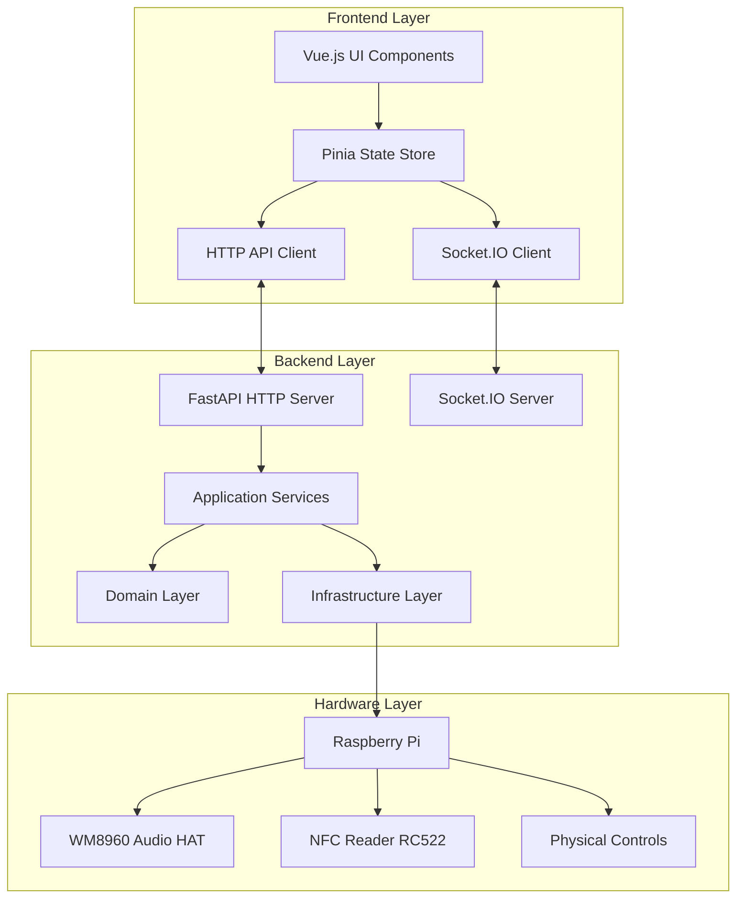
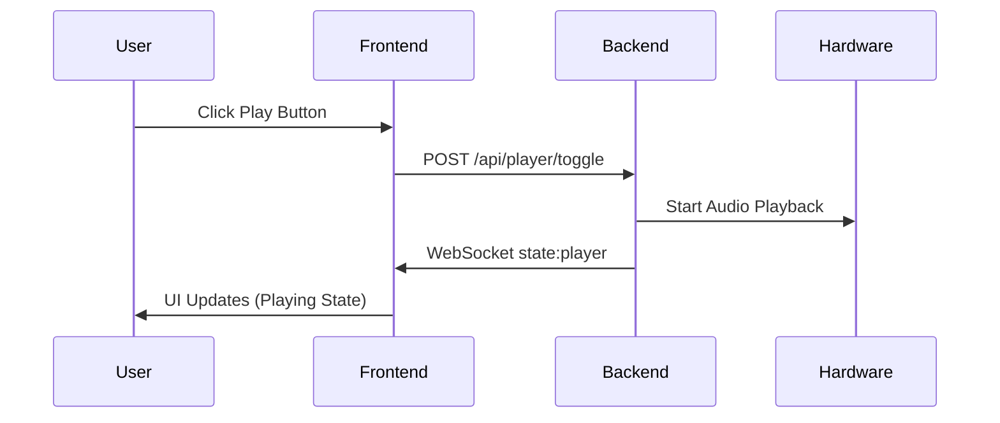
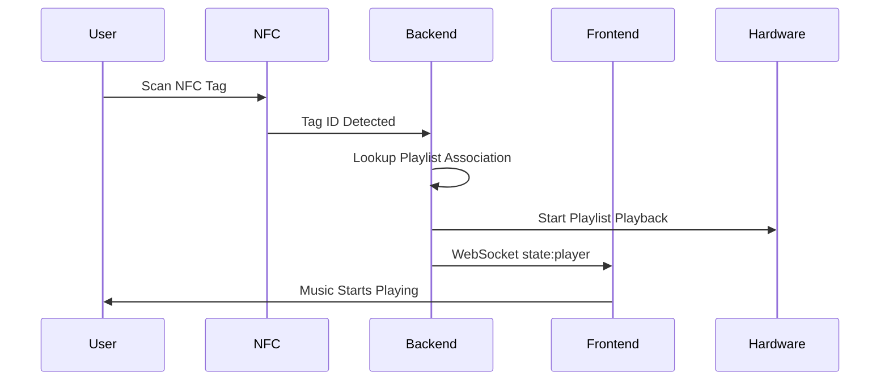
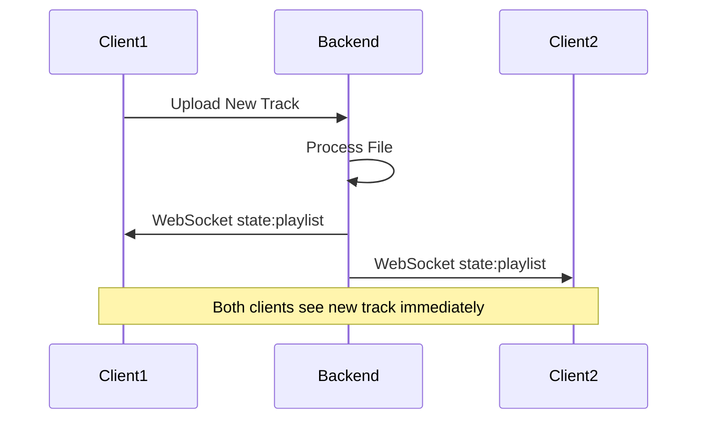

# Architecture Overview - The Open Music Box

## System Architecture Philosophy

The Open Music Box implements a **Server-Authoritative Domain-Driven Design (DDD)** architecture that ensures consistent state management, real-time synchronization, and clean separation of concerns across all layers.

## High-Level Architecture



## Core Design Principles

### 1. Server-Authoritative Pattern
- **Single Source of Truth**: Backend maintains authoritative state
- **Client Subscriptions**: Frontend subscribes to real-time updates
- **Event Sequencing**: All events have sequence numbers for ordering
- **Conflict Resolution**: Server state always takes precedence

### 2. Domain-Driven Design (DDD)
- **Application Layer**: Use case orchestration and API endpoints
- **Domain Layer**: Pure business logic and entities
- **Infrastructure Layer**: External integrations and hardware adapters
- **Dependency Inversion**: Protocols define interfaces, not implementations

### 3. Event-Driven Architecture
- **Real-time Communication**: WebSocket events for live updates
- **Event Sourcing**: State changes tracked through events
- **Reliable Delivery**: Outbox pattern with retry mechanisms
- **Client Synchronization**: Clients can request missed events

## System Components

### Frontend Architecture
- **Framework**: Vue.js 3 with Composition API
- **State Management**: Pinia store with reactive updates
- **Real-time**: Socket.IO client with auto-reconnection
- **HTTP Client**: Axios with standardized error handling
- **Styling**: Tailwind CSS with design system tokens

### Backend Services
- **HTTP API**: FastAPI with automatic OpenAPI documentation
- **WebSocket Server**: Socket.IO with room-based subscriptions
- **State Manager**: Centralized event broadcasting and sequencing
- **Audio Control**: Hardware abstraction for audio backends
- **Database**: SQLite with async connection pooling

### Hardware Integration
- **Audio Output**: WM8960 I2S HAT or system audio
- **NFC Reading**: RC522 reader with SPI communication
- **Physical Controls**: GPIO-connected buttons and encoders
- **Status Indicators**: LED status lights and displays

## Data Flow Patterns

### 1. User Action Flow


### 2. NFC Interaction Flow


### 3. Real-time Synchronization


## Technology Stack

### Core Technologies
| Component | Technology | Version | Purpose |
|-----------|------------|---------|---------|
| **Backend Framework** | FastAPI | 0.104+ | HTTP API server |
| **Frontend Framework** | Vue.js | 3.3+ | Reactive UI |
| **Real-time Communication** | Socket.IO | 5.0+ | WebSocket events |
| **Database** | SQLite | 3.40+ | Local persistence |
| **Hardware Platform** | Raspberry Pi | 4B/Zero 2W | Edge computing |
| **Audio Interface** | WM8960 HAT | Latest | High-quality audio |

### Development Tools
| Tool | Purpose | Configuration |
|------|---------|---------------|
| **TypeScript** | Frontend type safety | Strict mode enabled |
| **Pydantic** | Backend validation | V2 with JSON schema |
| **Black** | Python code formatting | 88 char line length |
| **ESLint** | JavaScript linting | Vue.js recommended |
| **Pytest** | Python testing | Coverage reporting |
| **Vite** | Frontend bundling | Fast development builds |

## Deployment Architecture

### Development Environment
```
┌─────────────────┐    ┌──────────────────┐
│   Developer     │    │   Raspberry Pi   │
│   Machine       │    │   Target Device  │
├─────────────────┤    ├──────────────────┤
│ • Vue.js Dev    │───▶│ • Python Backend │
│ • Hot Reload    │    │ • SQLite DB      │
│ • API Proxy     │    │ • Hardware Layer │
└─────────────────┘    └──────────────────┘
```

### Production Environment
```
┌──────────────────────────────────────┐
│           Raspberry Pi               │
├──────────────────────────────────────┤
│ • FastAPI Backend (Port 5004)       │
│ • Vue.js Frontend (Static Files)    │
│ • Socket.IO Server (Port 5004)      │
│ • SQLite Database (/data/music.db)  │
│ • Audio Hardware (WM8960)           │
│ • NFC Reader (RC522)                │
│ • File Storage (/data/uploads/)     │
└──────────────────────────────────────┘
```

## Performance Characteristics

### Scalability Metrics
- **Concurrent Users**: 10+ simultaneous web clients
- **File Upload**: 50MB+ files with chunked transfer
- **Real-time Updates**: 200ms position updates
- **Database Performance**: 1000+ tracks with sub-100ms queries
- **Memory Usage**: <512MB total system footprint

### Reliability Features
- **Auto-reconnection**: WebSocket clients reconnect automatically
- **Event Replay**: Clients can request missed events
- **Graceful Degradation**: Core functionality works without optional hardware
- **Error Recovery**: Automatic retry with exponential backoff
- **State Persistence**: Player state survives system restarts

## Security Model

### Network Security
- **Local Network Only**: No external internet requirements
- **CORS Protection**: Configurable allowed origins
- **Rate Limiting**: Per-endpoint request throttling
- **Input Validation**: Pydantic models validate all inputs

### Hardware Security
- **GPIO Permissions**: Secure hardware access controls
- **File System**: Sandboxed upload directories
- **Process Isolation**: Separate processes for audio and NFC
- **Resource Limits**: CPU and memory usage constraints

## Extension Points

### Plugin Architecture
- **Audio Backends**: Support for different audio hardware
- **Storage Providers**: Local files, network shares, cloud storage
- **Authentication**: Optional user management systems
- **External APIs**: Spotify, Apple Music, YouTube integrations

### Hardware Modularity
- **Optional Components**: System adapts to available hardware
- **GPIO Flexibility**: Configurable pin assignments
- **Audio Options**: Multiple output configurations
- **Display Support**: Optional status screens and indicators

This architecture provides a solid foundation for a reliable, extensible, and maintainable music player system that balances simplicity with powerful features.