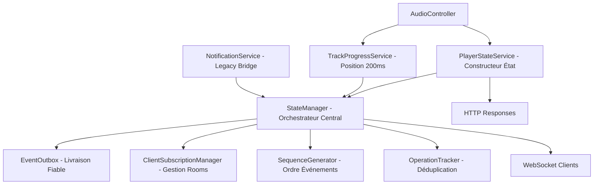
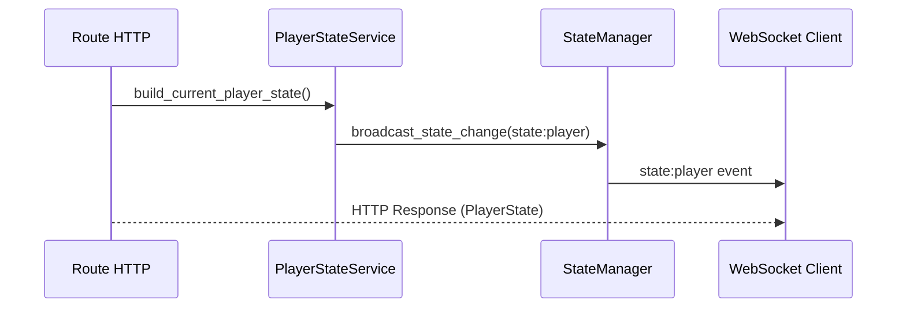
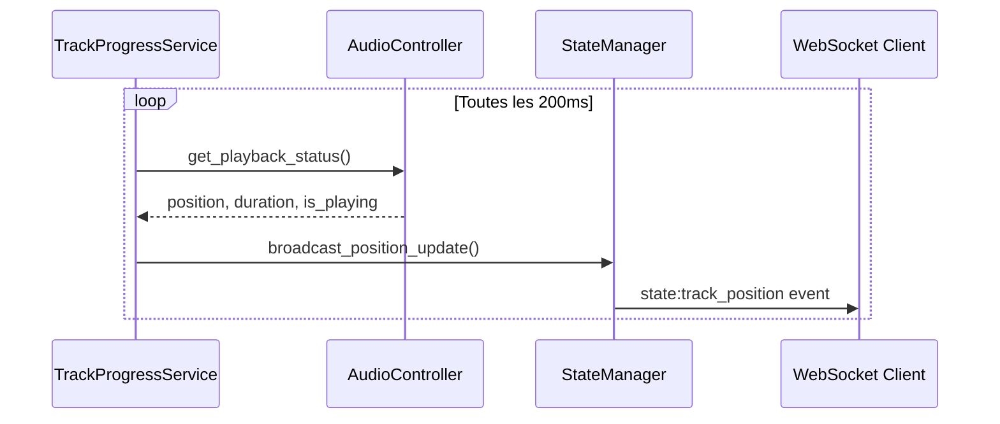
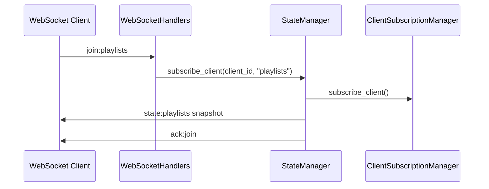
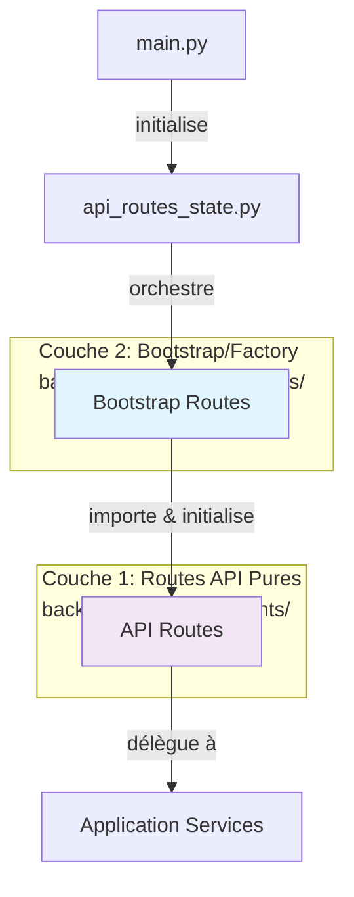

# Backend Services Architecture - TheOpenMusicBox

## Vue d'ensemble

TheOpenMusicBox utilise une **architecture Domain-Driven Design (DDD)** avec une approche **server-authoritative**. L'architecture sépare clairement les couches Application, Domaine et Infrastructure, avec 8 services coordonnés pour gérer l'état du player et les mises à jour temps réel.

## Architecture Générale



## Services Détaillés

### 1. StateManager - Orchestrateur Central ✅ ACTIF

**Fichier**: `app/src/services/state_manager.py`
**Classe**: `StateManager`

**Responsabilités**:
- Coordination centrale de tous les événements temps réel
- Diffusion WebSocket vers clients abonnés
- Gestion des salles ("playlists", "playlist:{id}")
- Interface unifiée pour broadcast d'état

**Méthodes clés**:
```python
async def broadcast_state_change(event_type, data, playlist_id=None)
async def broadcast_position_update(position_ms, track_id, is_playing)
async def subscribe_client(client_id, room)
```

**Composants internes**:
- **EventOutbox**: Livraison fiable avec retry
- **ClientSubscriptionManager**: Gestion abonnements clients
- **SequenceGenerator**: Numérotation séquentielle thread-safe
- **OperationTracker**: Prévention doublons

### 2. PlayerStateService - Constructeur d'État ✅ ACTIF

**Fichier**: `app/src/services/player_state_service.py`

**Responsabilités**:
- Construction d'objets PlayerState cohérents
- Interface unifiée entre AudioController et réponses API
- Normalisation des données player

**Méthodes clés**:
```python
async def build_current_player_state() -> PlayerState
async def build_track_progress_state() -> dict
async def broadcast_playlist_started(playlist_id)  # Legacy
```

**Usage**: Utilisé par toutes les routes player pour générer réponses HTTP standardisées.

### 3. TrackProgressService - Position Temps Réel ✅ ACTIF

**Fichier**: `app/src/services/track_progress_service.py`

**Responsabilités**:
- Émissions position toutes les 200ms pendant la lecture
- Mises à jour légères pour tracking fluide
- Throttling pour éviter spam (150ms minimum)
- Récupération d'erreur automatique

**Configuration**:
```python
POSITION_UPDATE_INTERVAL_MS = 200  # socket_config
POSITION_THROTTLE_MIN_MS = 150
```

**Flux de données**:
```
AudioController.get_playback_status() → position_ms, duration_ms, is_playing
→ StateManager.broadcast_position_update()
→ WebSocket state:track_position event
```

### 4. NotificationService - Service Transitionnel ⚠️️ PARTIELLEMENT ACTIF

**Fichier**: `app/src/services/notification_service.py`

**Composants**:

#### PlaybackSubject (Déprécié)
- **État**: Supprimé dans l'architecture DDD
- **Remplacement**: StateManager gère toutes les émissions
- **Migration**: Complètement migré vers StateManager

#### DownloadNotifier (Actif)
- **Usage**: Événements YouTube download
- **Émissions**: `youtube:progress`, `youtube:complete`, `youtube:error`

### 5-8. Composants Internes StateManager ✅ TOUS ACTIFS

#### ClientSubscriptionManager
```python
# Gestion abonnements WebSocket rooms
async def subscribe_client(client_id: str, room: str)
async def unsubscribe_client(client_id: str, room: str)
def get_subscribed_clients(room: str) -> Set[str]
```

#### EventOutbox
```python
# Livraison fiable avec retry
async def add_event(event_id, payload, target_room)
async def process_outbox()  # Retry failed emissions
```

#### SequenceGenerator
```python
# Numéros séquence thread-safe
async def get_next_global_seq() -> int
async def get_next_playlist_seq(playlist_id: str) -> int
```

#### OperationTracker
```python
# Prévention opérations dupliquées
def is_processed(client_op_id: str) -> bool
def mark_processed(client_op_id: str, result: any)
```

## Flux de Communication

### Événements Player State


### Position Updates Continus


### Abonnement Client


## Types d'Événements WebSocket

| Événement | Émetteur | Fréquence | Payload | Objectif |
|-----------|----------|-----------|---------|----------|
| `state:player` | StateManager | Sur demande | PlayerState complet | État complet player |
| `state:track_position` | TrackProgressService | 200ms | Position légère | Position fluide |
| `state:playlists` | StateManager | Sur demande | Collection playlists | Synchronisation listes |
| `youtube:progress` | DownloadNotifier | Continue | Progrès download | Feedback YouTube |

## Initialisation des Services

### Ordre de démarrage (Architecture DDD)
1. **main.py** → `Application.initialize_async()`
2. **DomainBootstrap** → Initialisation domaine
3. **Application Services** → Services applicatifs DDD
4. **StateManager** création avec composants internes
5. **TrackProgressService** planification démarrage background
6. **WebSocket handlers** enregistrement
7. **Infrastructure** → Services concrets (DB, Hardware)
8. Services prêts pour requêtes

### Configuration
```python
# app/src/config/socket_config.py - Configuration réelle
class SocketConfig:
    POSITION_UPDATE_INTERVAL_MS = 200
    POSITION_THROTTLE_MIN_MS = 150
    OUTBOX_RETRY_MAX = 3
    OUTBOX_SIZE_LIMIT = 1000
    OPERATION_DEDUP_WINDOW_SEC = 300
    CLIENT_TIMEOUT_SEC = 60
```

## Patterns Architecturaux

### Server-Authoritative
- **Source unique vérité**: Backend maintient état autoritaire
- **Clients abonnés**: Frontend s'abonne aux mises à jour
- **Séquençage**: Tous événements ont numéro séquence
- **Résolution conflits**: État serveur toujours prioritaire

### Event Sourcing
- **Envelope standardisée**: Tous événements suivent même format
- **Séquence globale**: Ordre chronologique garanti
- **Traçabilité**: event_id unique pour debugging
- **Replay**: Possibilité reconstituer état

### Reliability Patterns
- **Outbox Pattern**: Queue événements avec retry
- **Circuit Breaker**: Récupération erreur automatique
- **Throttling**: Prévention surcharge réseau
- **Deduplication**: Évite traitement multiple

## Métriques et Monitoring

### Statistiques disponibles
```python
# Méthode get_stats() disponible pour monitoring
# Structure exacte dépend de l'implémentation StateManager
```

### Logging
- **StateManager**: Événements non-position seulement (évite spam)
- **TrackProgressService**: Erreurs et récupération
- **Composants**: Statistiques périodiques

## Cohérence Frontend-Backend

### Événements WebSocket
- **Backend StateManager** → **Frontend socketService** → **serverStateStore**
- Format standardisé avec envelope et séquence
- Rooms appropriées pour efficacité

### Réponses HTTP
- **Backend PlayerStateService** → **Frontend apiService** → **UI Components**
- Structure PlayerState identique
- Gestion erreur cohérente

Cette architecture garantit une **communication temps réel fiable** avec **état cohérent** entre tous les clients et **performance optimale** via throttling intelligent.

## Architecture de Routing (Two-Layer Pattern)

TheOpenMusicBox implémente une **architecture de routing à deux couches** suivant les principes DDD et Dependency Injection.

### Vue d'ensemble



### Couche 1: Routes API Pures (`back/app/src/api/endpoints/`)

**Responsabilités**:
- Définition des endpoints FastAPI
- Gestion requête/réponse HTTP
- Validation des entrées (Pydantic)
- Délégation de la logique métier
- **NE GÈRE PAS**: Instantiation de services, gestion du cycle de vie

**Fichiers** (7 au total, ~2,829 LOC):
- `player_api_routes.py` - Endpoints de contrôle player
- `nfc_api_routes.py` - Endpoints d'association NFC
- `playlist_api_routes.py` - Endpoints de gestion playlists
- `system_api_routes.py` - Endpoints système et santé
- `upload_api_routes.py` - Endpoints de sessions upload
- `web_api_routes.py` - Endpoints web/statiques
- `youtube_api_routes.py` - Endpoints YouTube

### Couche 2: Routes Bootstrap (`back/app/src/routes/factories/`)

**Responsabilités**:
- Création et câblage des dépendances
- Initialisation des services
- Configuration de l'injection de dépendances
- Enregistrement des routes avec FastAPI
- Gestion du cycle de vie

**Fichiers** (7 au total, ~761 LOC):
- `player_routes_ddd.py` - Bootstrap player routes
- `nfc_unified_routes.py` - Bootstrap NFC routes
- `playlist_routes_ddd.py` - Bootstrap playlist routes
- `system_routes.py` - Bootstrap système routes
- `upload_routes.py` - Bootstrap upload routes
- `web_routes.py` - Bootstrap web routes
- `youtube_routes.py` - Bootstrap YouTube routes

### Flux de dépendances

```python
# Layer 2: Bootstrap (routes/factories/player_routes_ddd.py)
class PlayerRoutesDDD:
    def __init__(self, app, socketio, coordinator):
        # Initialise les services
        self.state_manager = UnifiedStateManager(socketio)
        self.player_service = PlayerApplicationService(coordinator, self.state_manager)
        self.broadcasting_service = PlayerBroadcastingService(self.state_manager)

        # Initialise les routes API avec dépendances
        self.api_routes = PlayerAPIRoutes(
            player_service=self.player_service,
            broadcasting_service=self.broadcasting_service
        )

        # Enregistre avec FastAPI
        app.include_router(self.api_routes.get_router())

# Layer 1: API Routes (api/endpoints/player_api_routes.py)
class PlayerAPIRoutes:
    def __init__(self, player_service, broadcasting_service):
        self.router = APIRouter(prefix="/api/player")
        self._player_service = player_service  # Reçu par DI
        self._broadcasting_service = broadcasting_service

    def _register_routes(self):
        @self.router.post("/play")
        async def play():
            # Délègue au service - pas d'instantiation
            result = await self._player_service.play_use_case()
            await self._broadcasting_service.broadcast_state_change(...)
            return UnifiedResponseService.success(...)
```

### Avantages de cette architecture

1. **Séparation des responsabilités**
   - Routes API: logique HTTP uniquement
   - Bootstrap: gestion des dépendances uniquement

2. **Testabilité**
   - Routes API testables avec mocks
   - Bootstrap testable pour vérifier le câblage

3. **Flexibilité**
   - Facile de remplacer les implémentations
   - Modifications de dépendances isolées

4. **Clean Architecture**
   - Respecte la direction des dépendances
   - Suit les principes DDD

### Patterns utilisés

- **Factory Pattern**: Bootstrap routes créent et configurent les handlers
- **Dependency Injection**: Dépendances injectées par constructeur
- **Single Responsibility**: Chaque couche a une responsabilité unique

### ⚠️ Note importante

Cette structure **N'EST PAS une duplication** mais un pattern architectural intentionnel. Les deux dossiers de routes servent des objectifs complémentaires distincts.

**Documentation complète**: Voir [routing-architecture.md](./routing-architecture.md) pour détails complets.