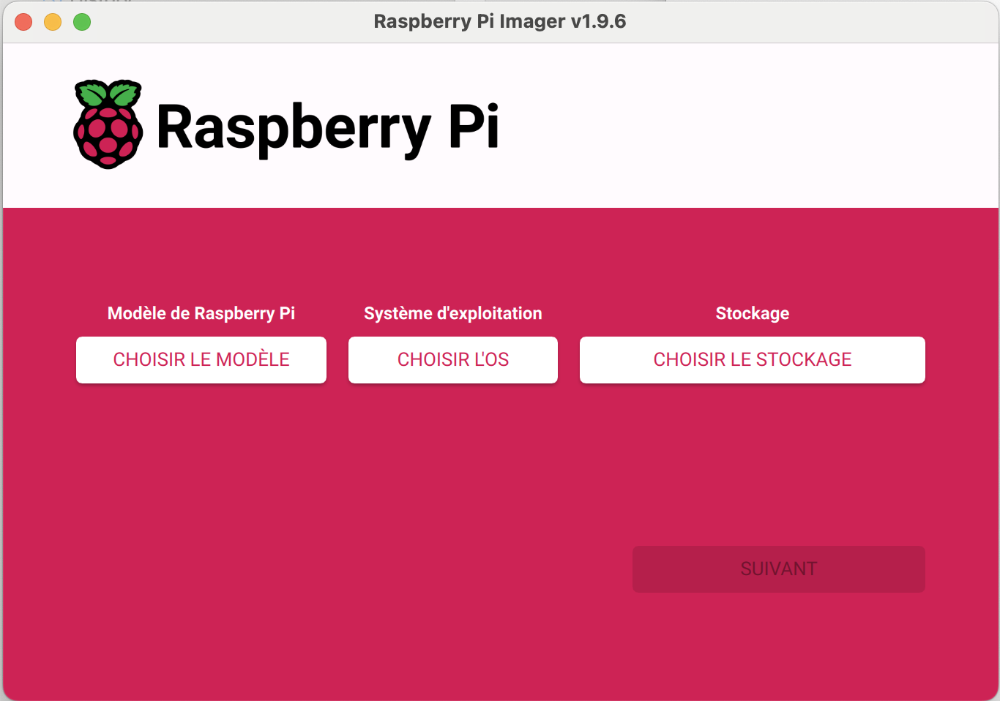
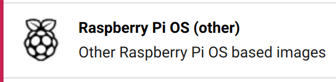
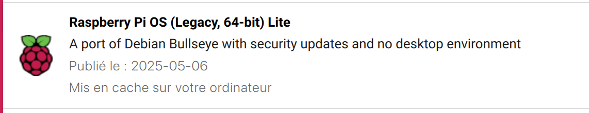
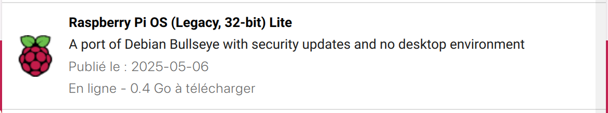
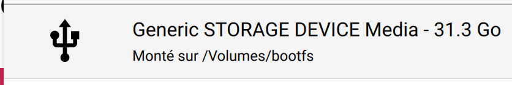
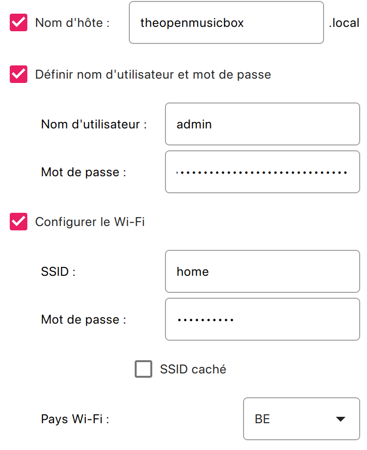

# Déploiement de The Open Music Box sur Raspberry Pi

## Vue d'ensemble

Ce guide détaille le processus de déploiement automatisé de l'application **The Open Music Box** sur un Raspberry Pi. Le système utilise des scripts automatisés pour simplifier l'installation et la configuration.

## Architecture du système

- **Serveur cible** : Raspberry Pi avec Raspberry Pi OS
- **Carte audio** : WM8960 Audio HAT (Waveshare)
- **Application** : Python avec service systemd
- **Déploiement** : Scripts bash automatisés

---

## 1. Création de la carte SD

### Installer Raspberry Pi Imager



**Étape 1 :** Télécharger et installer Raspberry Pi Imager depuis [rpi.org](https://www.raspberrypi.org/software/)


**Étape 2 :** Cliquer sur "CHOISIR L'OS" pour sélectionner le système d'exploitation



**Étape 3 :** Sélectionner "Raspberry Pi OS (other)" pour accéder aux options OS



**Étape 4 :** Choisir "Raspberry Pi OS (Legacy, 64-bit) Lite" - Version recommandée pour The Open Music Box



**Alternative :** "Raspberry Pi OS (Legacy, 32-bit) Lite **Bullseye**" est également compatible


**Étape 5 :** Cliquer sur "CHOISIR LE STOCKAGE" pour sélectionner votre carte SD



**Étape 6 :** Choisir votre carte microSD (64GB recommandé)


**Étape 7 :** Cliquer sur "SUIVANT" pour continuer


**Étape 8 :** Cliquer sur "MODIFIER RÉGLAGES" pour configurer les paramètres avancés



**Configuration avancée :**
- ✅ **Nom d'hôte** : `theopenmusicbox.local`
- ✅ **Nom d'utilisateur** : `admin` (recommandé pour les scripts)
- ✅ **Mot de passe** : Choisir un mot de passe sécurisé
- ✅ **Configurer le Wi-Fi** :
  - SSID : `home` (votre réseau WiFi)
  - Mot de passe : Votre mot de passe WiFi
  - Pays Wi-Fi : `BE` (Belgique) ou votre pays

### Finalisation de l'installation

**Étape 9 :** Une fois la configuration terminée, cliquer sur "OUI" pour écrire l'image sur la carte SD

**Étape 10 :** Attendre la fin du processus d'écriture et de vérification

---

## 2. Configuration SSH et accès distant

### Étape 1 : Configuration de la clé SSH

Une fois la carte SD prête, insérez-la dans le Raspberry Pi et attendez 2-3 minutes pour le premier démarrage.

#### Commande d'exécution

```bash
./setup_ssh_key_to_rpi.sh
```

Le script `setup_ssh_key_to_rpi.sh` automatise la configuration de l'accès SSH sécurisé :

```
user@mac tomb-rpi % ./setup_ssh_key_to_rpi.sh

    ========================================
    🎵  The Open Music Box SSH Setup  🎵
    ========================================

Enhanced SSH Key Setup for Raspberry Pi

ℹ️  Setting up SSH directory and permissions...
✅ SSH directory permissions configured correctly
🗝️  Found existing SSH keys:
  1) id_ed25519
  2) musicbox_key
  3) rpi_local
  4) tomb
  5) Create a new key

Choose an option (1-5): 4
✅ Using existing key: tomb
👤 Username on the Raspberry Pi (e.g., pi): admin
🌐 IP address or hostname of the Raspberry Pi: theopenmusicbox.local
ℹ️  Testing connectivity to theopenmusicbox.local...
✅ Host theopenmusicbox.local is reachable via ping
🔖 SSH shortcut name (e.g., rpi): tomb
⚠️️  SSH alias 'tomb' already exists in config
Do you want to overwrite it? [y/N]: y
ℹ️  Removed existing entry for 'tomb'
ℹ️  Copying public key to theopenmusicbox.local...
⚠️️  Detected possible host key conflict for theopenmusicbox.local
ℹ️  Found existing host key for theopenmusicbox.local in known_hosts
Do you want to remove the old host key and accept the new one? [Y/n]: y
✅ Removed old host key(s) for theopenmusicbox.local
ℹ️  You will be prompted for your password...
ℹ️  Using ssh-copy-id to copy the key...
/usr/bin/ssh-copy-id: INFO: Source of key(s) to be installed: "/Users/user/.ssh/tomb.pub"
/usr/bin/ssh-copy-id: INFO: attempting to log in with the new key(s), to filter out any that are already installed
/usr/bin/ssh-copy-id: INFO: 1 key(s) remain to be installed -- if you are prompted now it is to install the new keys
admin@theopenmusicbox.local's password:

Number of key(s) added:        1

Now try logging into the machine, with: "ssh -i /Users/user/.ssh/tomb -o 'StrictHostKeyChecking=accept-new' 'admin@theopenmusicbox.local'"
and check to make sure that only the key(s) you wanted were added.

✅ Public key copied successfully using ssh-copy-id
ℹ️  Adding entry to SSH config...
✅ SSH config updated successfully
ℹ️  Adding key to SSH agent...
✅ Key added to SSH agent
ℹ️  Testing SSH connection...
SSH connection test successful
✅ Passwordless SSH authentication working!

🎉 Setup completed successfully!
💻 You can now connect to your Raspberry Pi with: ssh tomb

Would you like to connect now? [y/N]: y
Warning: Permanently added 'theopenmusicbox.local' (ED25519) to the list of known hosts.
Linux theopenmusicbox 6.1.21-v8+ #1642 SMP PREEMPT Mon Apr  3 17:24:16 BST 2023 aarch64

The programs included with the Debian GNU/Linux system are free software;
the exact distribution terms for each program are described in the
individual files in /usr/share/doc/*/copyright.

Debian GNU/Linux comes with ABSOLUTELY NO WARRANTY, to the extent
permitted by applicable law.
Last login: Tue May  6 15:39:07 2025
admin@theopenmusicbox:~ $
```

### Étape 2 : Connexion SSH établie

Une fois la clé configurée, l'accès SSH est sécurisé et automatique :

```
user@mac tomb-rpi % ssh tomb
Warning: Permanently added 'theopenmusicbox.local' (ED25519) to the list of known hosts.
Linux theopenmusicbox 6.1.21-v8+ #1642 SMP PREEMPT Mon Apr  3 17:24:16 BST 2023 aarch64

The programs included with the Debian GNU/Linux system are free software;
the exact distribution terms for each program are described in the
individual files in /usr/share/doc/*/copyright.

Debian GNU/Linux comes with ABSOLUTELY NO WARRANTY, to the extent
permitted by applicable law.
Last login: Tue Sep 23 08:32:07 2025 from 2a02:578:85ec:1400:e8b7:2208:5ce0:e788
admin@theopenmusicbox:~ $ exit
```

---

## 3. Installation sur le Raspberry Pi

### Vue du processus d'installation

L'installation s'effectue depuis votre ordinateur via SSH avec affichage en temps réel :

```bash
./deploy.sh --prod tomb
```

Une fois la commande `deploy.sh` exécutée, vous êtes connecté au raspberry.

🚨 **Important** : Le script ne redémarre pas le service au premier lancement car l'application n'est pas encore installée

### Script d'installation automatique

Le processus d'installation comprend :

```bash
# Mise à jour du système
sudo apt-get update
sudo apt-get upgrade
sudo apt-get install git
sudo apt-get install vsftpd # optionnel

# Installation de la carte audio WM8960
git clone https://github.com/waveshare/WM8960-Audio-HAT
cd WM8960-Audio-HAT
sudo ./install.sh
sudo reboot

# Test du système audio
aplay /usr/share/sounds/alsa/Front_Center.wav

# Installation de l'application The Open Music Box
git clone [votre-repo-url] tomb
chmod +x tomb/setup.sh
sudo ./tomb/setup.sh

# Observation des logs de l'app:
sudo journalctl -fu app.service --output=cat

# Configuration FTP (optionnelle):
sudo nano /etc/vsftpd.conf
```

---

## 4. Configuration finale

### Messages de confirmation

Le script d'installation affiche un récapitulatif des services configurés :

```
Setup complete!
→ Service installé : sudo systemctl status app
→ Configuration dans le fichier .env
→ Lancement : sudo systemctl start app
```

### Vérification de l'installation

#### 1. Vérifier le service

```bash
# Vérifier le statut du service
sudo systemctl status app

# Si le service n'est pas démarré, le lancer
sudo systemctl start app

# Activer le service au démarrage
sudo systemctl enable app
```

#### 2. Tester l'accès web

Une fois le service démarré, accéder à l'interface web :

- **URL locale** : `http://theopenmusicbox.local:5004`
- **URL IP** : `http://[ip-du-raspberry]:5004`

#### 3. Vérifier l'audio

```bash
# Tester la sortie audio
aplay /usr/share/sounds/alsa/Front_Center.wav

# Lister les périphériques audio
aplay -l

# Ajuster le volume
alsamixer
```

---

## 5. Synchronisation et déploiement continu

### Script de synchronisation

Le script `sync_tmbdev.sh` permet la mise à jour continue du code et de la configuration :

```bash
user@mac tomb-rpi % ./sync_tmbdev.sh
========================================
🎵  The Open Music Box Sync  🎵
========================================
✅ Synchronization completed without errors.
🔧 Fixing permissions on the remote directory...
🔍 Validating configuration deployment...
✅ Configuration file (.env) successfully deployed to server.
🎉 All done! Files are in /home/admin/tomb on the RPi.
```

---

## 6. Commandes utiles

### Gestion du service

```bash
# Vérifier le statut
sudo systemctl status app

# Démarrer le service
sudo systemctl start app

# Arrêter le service
sudo systemctl stop app

# Redémarrer le service
sudo systemctl restart app

# Voir les logs en temps réel
journalctl -u app -f

# Voir les derniers logs
journalctl -u app -n 50
```

### Fichiers importants

- **Configuration** : `/home/admin/tomb/.env`
- **Application** : `/home/admin/tomb/`
- **Logs système** : `journalctl -u app`
- **Base de données** : `/home/admin/tomb/data/music.db`
- **Fichiers uploadés** : `/home/admin/tomb/data/uploads/`

---

## 7. Configuration matérielle

### Carte audio WM8960

Si vous utilisez la carte audio WM8960 HAT :

```bash
# Vérifier que la carte est détectée
aplay -l
# Devrait afficher : Card 1: wm8960soundcard [wm8960-soundcard]

# Tester la sortie stéréo
speaker-test -t wav -c 2

# Configurer comme sortie par défaut
sudo raspi-config
# Advanced Options > Audio > Force 3.5mm jack: Non
```

### Lecteur NFC (optionnel)

Si vous avez un lecteur NFC RC522 :

```bash
# Activer SPI
sudo raspi-config
# Interface Options > SPI > Enable

# Vérifier SPI
ls /dev/spi*
# Devrait afficher : /dev/spidev0.0  /dev/spidev0.1

# Tester le lecteur NFC
python3 -c "from app.hardware.nfc import NFCReader; print(NFCReader().is_available())"
```

---

## Prérequis matériels

### Configuration minimale
- Raspberry Pi Zero 2W ou Raspberry Pi 4B
- Carte microSD 32GB (Classe 10 minimum)
- Alimentation 5V 2.5A (Pi Zero) ou 5V 3A (Pi 4)
- Connexion réseau WiFi
- Haut-parleurs ou casque (jack 3.5mm ou USB)

### Configuration recommandée
- Raspberry Pi 4B (1GB RAM minimum)
- Carte microSD 64GB+ (U1/A1 pour de meilleures performances)
- WM8960 Audio HAT avec haut-parleurs stéréo
- Lecteur NFC RC522 pour les fonctionnalités NFC
- Alimentation avec batterie pour la portabilité

---

## Troubleshooting

### Problèmes courants

#### Le service ne démarre pas
```bash
# Vérifier les logs détaillés
sudo journalctl -u app -n 100

# Vérifier la configuration
cat /home/admin/tomb/.env

# Vérifier les permissions
ls -la /home/admin/tomb/

# Réinstaller les dépendances
cd /home/admin/tomb
pip install -r requirements.txt
```

#### Pas de son
```bash
# Vérifier les périphériques audio
aplay -l

# Tester la sortie audio
aplay /usr/share/sounds/alsa/Front_Center.wav

# Réinstaller les pilotes WM8960
cd ~/WM8960-Audio-HAT
sudo ./install.sh
sudo reboot
```

#### Problème de réseau
```bash
# Vérifier que le service écoute
sudo netstat -tlnp | grep 5004

# Tester l'accès local
curl http://localhost:5004/api/health

# Vérifier le pare-feu
sudo ufw status
```

#### Lecteur NFC ne fonctionne pas
```bash
# Vérifier SPI
ls /dev/spi*

# Vérifier les connexions
# RC522 -> Raspberry Pi
# 3.3V -> Pin 1 (3.3V)
# RST  -> Pin 22 (GPIO25)
# GND  -> Pin 6 (GND)
# MISO -> Pin 21 (GPIO9)
# MOSI -> Pin 19 (GPIO10)
# SCK  -> Pin 23 (GPIO11)
# SDA  -> Pin 24 (GPIO8)
```

---

Ce guide de déploiement vous permettra d'installer et configurer The Open Music Box sur votre Raspberry Pi avec toutes les fonctionnalités audio et NFC.