# The Open Music Box - Guide d'achat DIY
*Lecteur audio pour enfants basé sur Raspberry Pi*

## 📋 Vue d'ensemble

The Open Music Box est un lecteur audio DIY conçu spécialement pour les enfants. Basé sur Raspberry Pi, il offre une interface simple et intuitive avec des fonctionnalités modernes comme la lecture NFC, le contrôle sans fil, et une conception robuste adaptée aux petites mains.

## 🎯 Fonctionnalités

- **Lecture audio** : MP3, FLAC, WAV et autres formats courants
- **Interface NFC** : Cartes/étiquettes NFC pour sélection rapide des contenus
- **Contrôles tactiles** : Boutons d'action et encodeur rotatif
- **Connectivité Wi-Fi** : Streaming et mise à jour du contenu
- **Autonomie** : Fonctionnement sur batterie (optionnel)
- **Design modulaire** : Composants optionnels selon les besoins

## 🛒 Composants et coûts

### 💻 Composants principaux (obligatoires)

| Composant | Description | Prix | Lien d'achat |
|-----------|-------------|------|--------------|
| 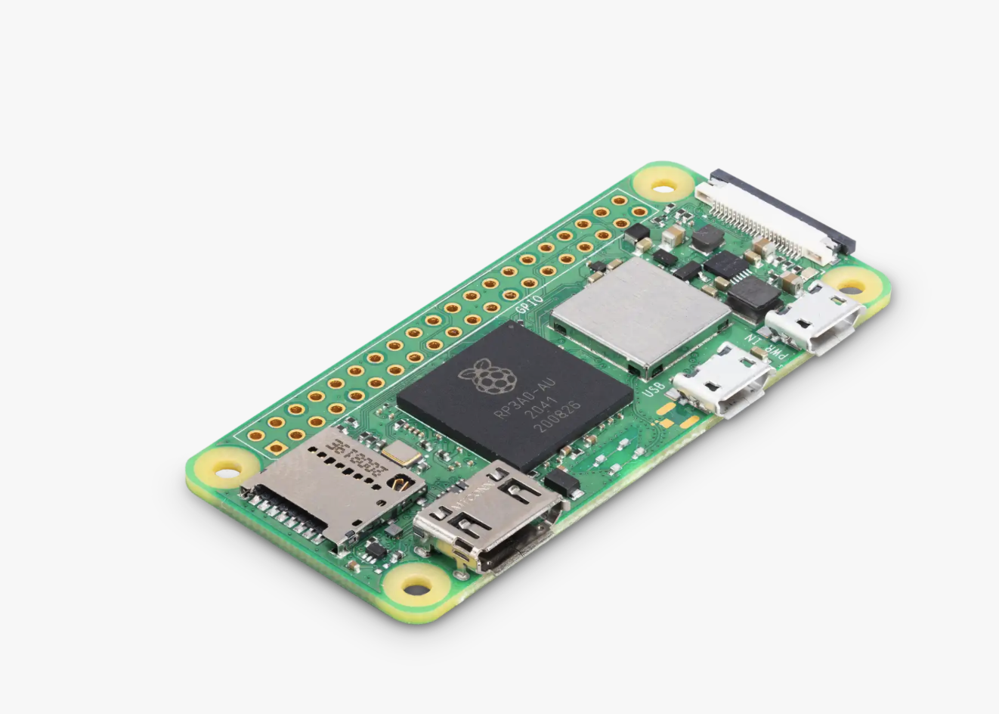 **Raspberry Pi Zero 2W** *(Budget)* | Processeur ARM Cortex-A53 quad-core 1GHz, 512MB RAM, WiFi 2.4GHz, Bluetooth 4.2. Compact mais démarrage plus lent. | **16.69€** | [Raspberry Pi Official](https://www.raspberrypi.com/products/raspberry-pi-zero-2-w/) |
| 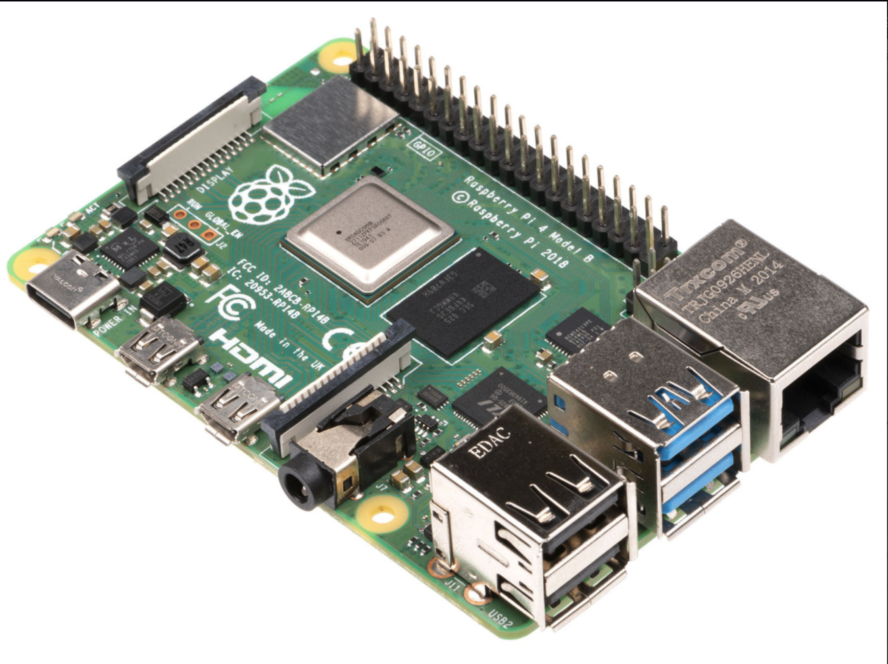 **Raspberry Pi 4 Model B 1GB** *(Performance)* | Processeur ARM Cortex-A72 quad-core 1.5GHz, 1GB RAM, WiFi dual-band, Bluetooth 5.0, USB 3.0, démarrage rapide. | **37.50€** | [Raspberry Pi Official](https://www.raspberrypi.com/products/raspberry-pi-4-model-b/?variant=raspberry-pi-4-model-b-1gb) |
|  **Carte MicroSD 64GB** | Samsung Evo Select - Vitesse de lecture jusqu'à 130MB/s, Classe 10, U1, A1. Recommandée pour la compatibilité et fiabilité. | **9.41€** | [Amazon France](https://www.amazon.fr/dp/B09D3N56DD) |
| 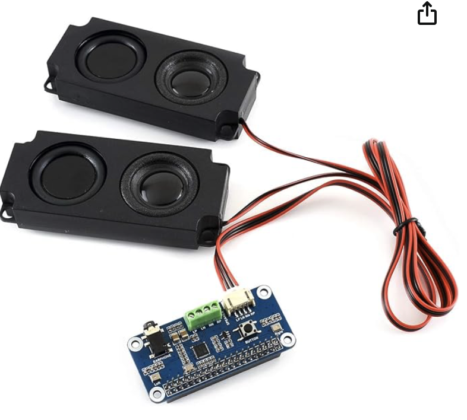 **Carte audio RPi + Haut-parleurs** | Module audio intégré avec amplificateur stéréo et deux haut-parleurs. Solution tout-en-un pour l'audio. | **25.00€** | [Amazon France](https://www.amazon.fr/dp/B07KN8424G) |

### ⚡ Alimentation (recommandé)

| Composant | Description | Prix | Lien d'achat |
|-----------|-------------|------|--------------|
|  **Interrupteur d'alimentation** | Interrupteur marche/arrêt étanche pour contrôle propre de l'alimentation. Évite les corruptions de données. | **0.13€** | [Amazon France](https://www.amazon.fr/dp/B07Z4RW9X6) |
|  **Batterie Li-Po 3.7V** | Batterie rechargeable 5000mAh avec connecteur JST 2.0. ⚠️ **ATTENTION**: nécessite le gestionnaire obligatoire. | **8.29€** | [AliExpress](https://www.aliexpress.com/item/1005008867815394.html) |
| 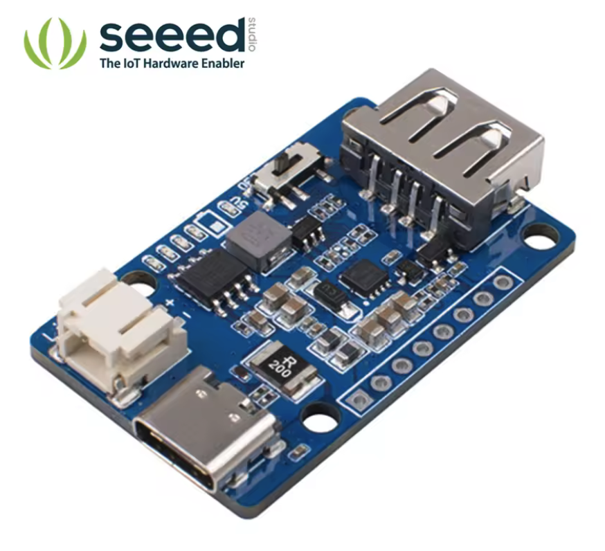 **Gestionnaire d'alimentation** | Module de gestion et protection batterie Li-Po obligatoire. Protège contre surcharge/décharge. | **6.01€** | [AliExpress](https://aliexpress.com/item/4000572310671.html) |
|  **Connecteur USB-C** | Connecteur de charge USB-C étanche pour recharge externe. Moderne et pratique. | **0.44€** | [AliExpress](https://aliexpress.com/item/1005008130307658.html) |
| 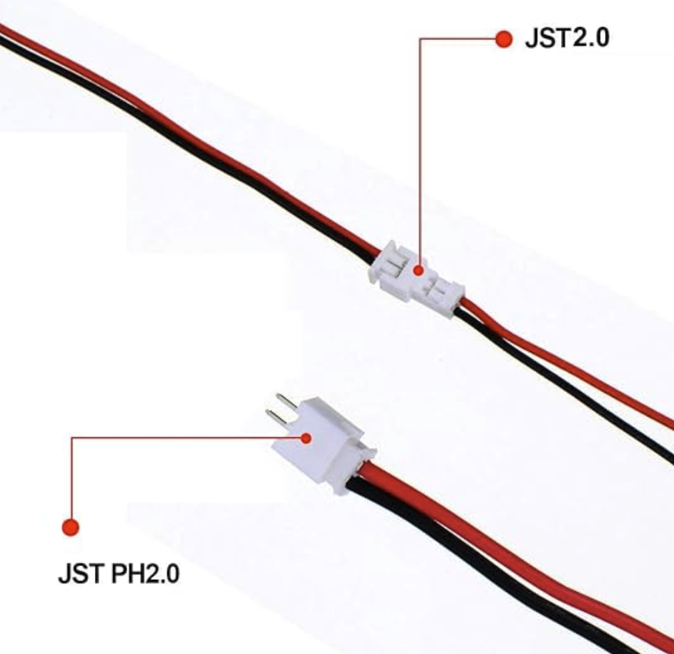 **Connecteurs JST 2.0 PH (lot de 10)** | Connecteurs pour liaison batterie. Permettent connexions propres et sécurisées. | **0.34€** | Magasins électronique |

### 🎮 Interface utilisateur (optionnel)

| Composant | Description | Prix | Lien d'achat |
|-----------|-------------|------|--------------|
| 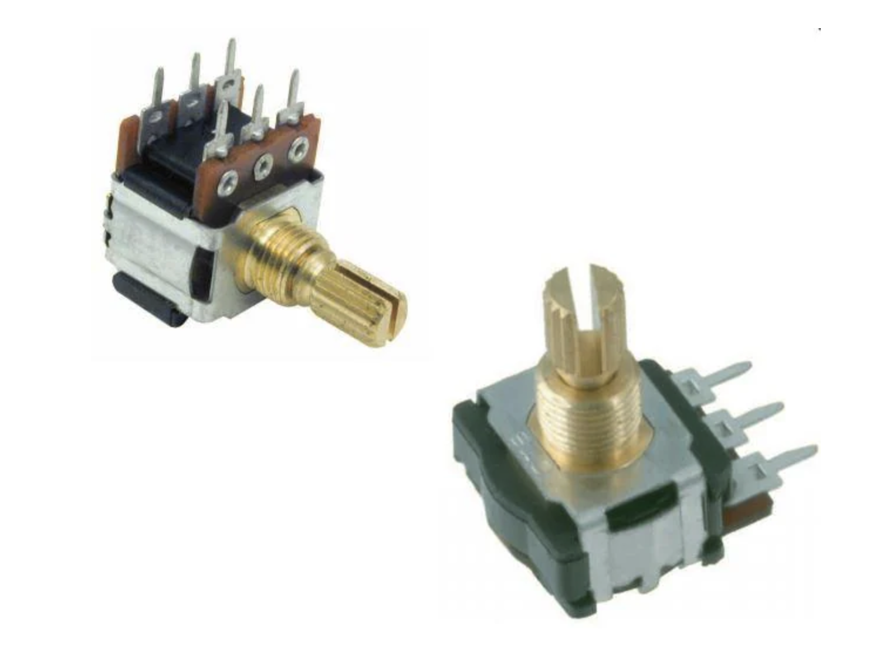 **Encodeur rotatif avec bouton** | Contrôle de volume et navigation dans les menus. Rotation douce avec clic de validation. | **6.46€** | [Mouser](https://www.mouser.be/ProductDetail/774-288V220R161B2) |
| 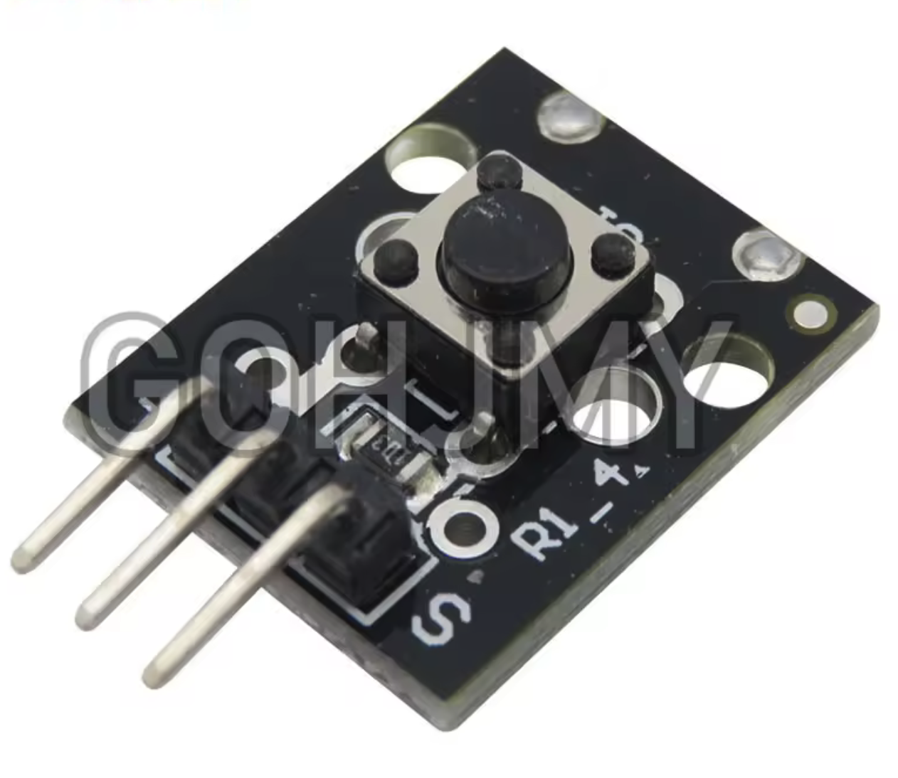 **Bouton pour encodeur rotatif** | Capuchon d'encodeur ergonomique pour manipulation facile par les enfants. | **3.80€** | [AliExpress](https://www.aliexpress.com/item/1005008798696666.html) |
| 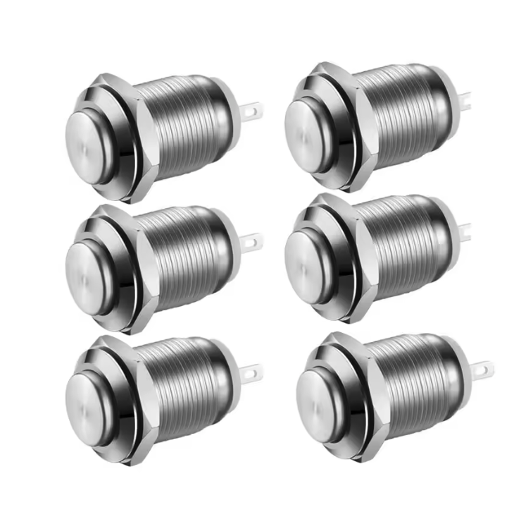 **Boutons d'action 12mm (lot de 6)** | Boutons tactiles colorés pour lecture/pause, précédent/suivant. Taille adaptée aux enfants. | **2.10€** | [AliExpress](https://aliexpress.com/item/1005009681060148.html) |
| **Bouton de reset** | Bouton encastré pour configuration Wi-Fi et remise à zéro. Évite les actions accidentelles. | **0.26€** | [AliExpress](https://www.aliexpress.com/item/1005006984428058.html) |
| 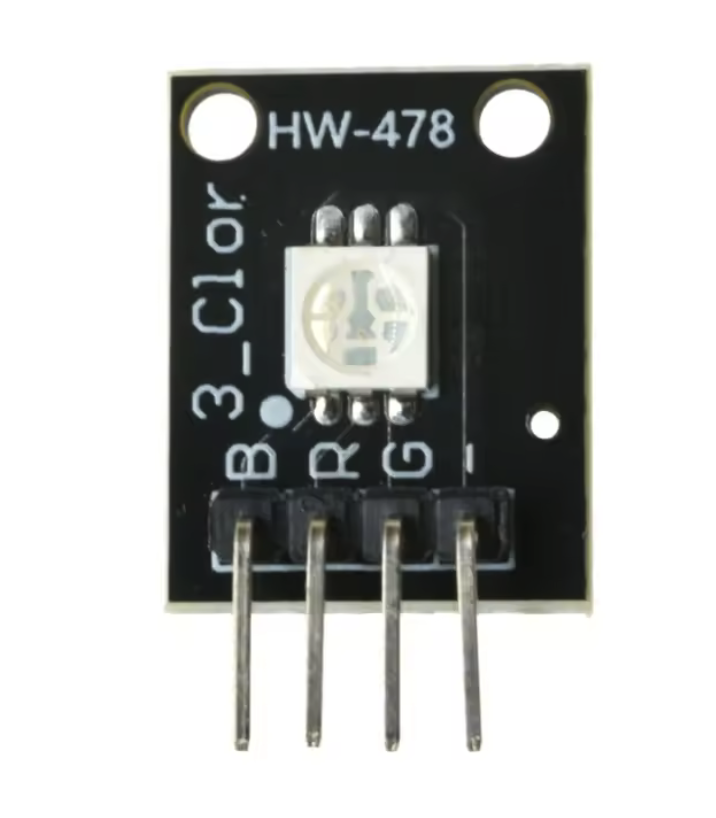 **LED de statut (lot de 10)** | LEDs colorées pour indication visuelle de l'état (marche/arrêt/charge/erreur). | **0.20€** | [AliExpress](https://www.aliexpress.com/item/1005006764822374.html) |

### 📡 Fonctionnalités avancées (optionnel)

| Composant | Description | Prix | Lien d'achat |
|-----------|-------------|------|--------------|
| 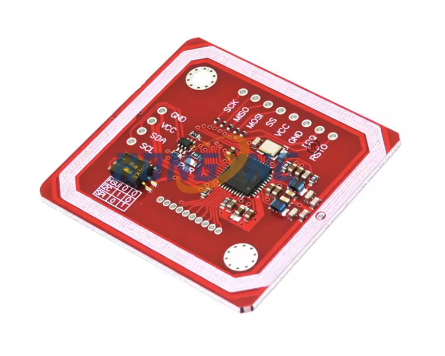 **Lecteur NFC RC522** | Module NFC pour cartes et étiquettes. Permet sélection de musique par simple pose d'une carte. | **2.57€** | [AliExpress](https://www.aliexpress.com/item/1005007492284526.html) |

### 🔧 Accessoires (optionnel)

| Composant | Description | Prix | Lien d'achat |
|-----------|-------------|------|--------------|
| 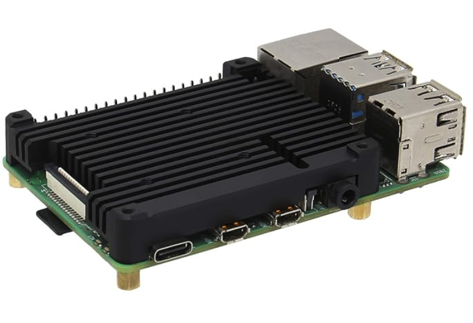 **Refroidisseur pour RPi 4** | Dissipateur thermique avec ventilateur pour Raspberry Pi 4. Recommandé pour utilisation intensive. | **9.00€** | [Amazon France](https://www.amazon.fr/dp/B08N617L1J) |
| 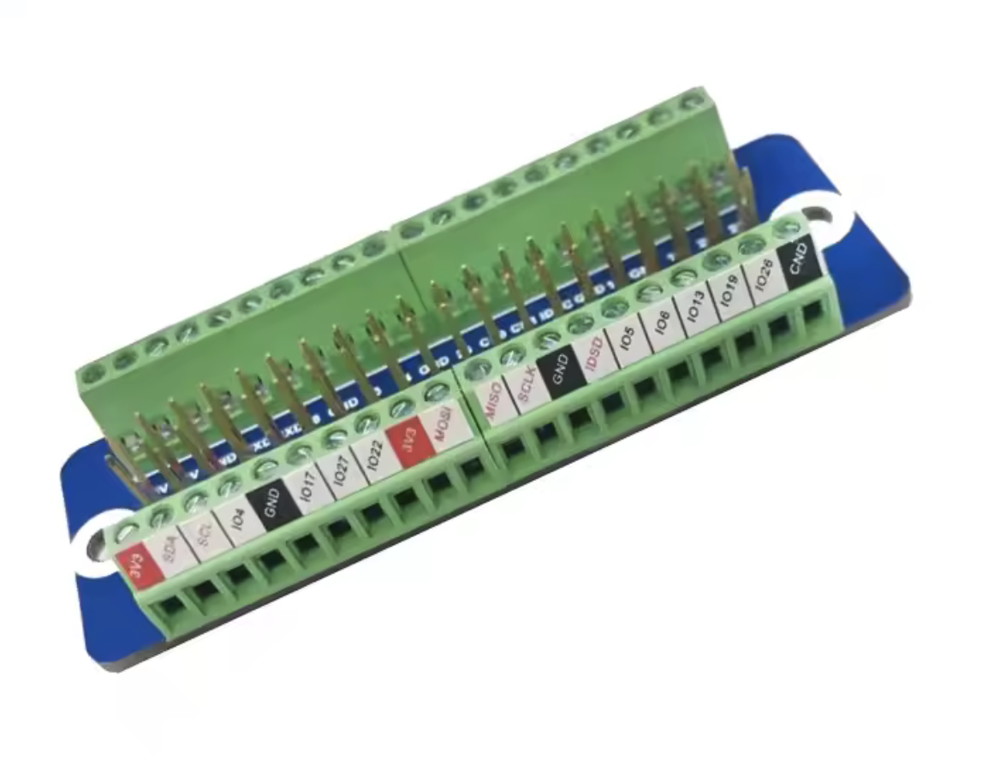 **Carte d'extension GPIO** | Facilite les connexions et prototypage. Évite la soudure directe sur le Pi. | **4.89€** | [AliExpress](https://www.aliexpress.com/item/1005006730168523.html) |

## 💰 Configurations recommandées

### 🏠 Configuration Budget - **87.18€**
*Basée sur Raspberry Pi Zero 2W*

**✅ Inclus :**
- Raspberry Pi Zero 2W (16.69€)
- Stockage + Audio (34.41€)
- Alimentation complète (15.21€)
- Interface utilisateur complète (12.82€)
- Fonctionnalités avancées (2.57€)
- Accessoires (4.89€)

### 🚀 Configuration Performance - **116.99€**
*Basée sur Raspberry Pi 4*

**✅ Inclus :**
- Raspberry Pi 4 Model B 1GB (37.50€)
- Stockage + Audio (34.41€)
- Alimentation complète (15.21€)
- Interface utilisateur complète (12.82€)
- Fonctionnalités avancées (2.57€)
- Accessoires + Refroidissement (13.89€)

### 🎯 Configuration Minimale - **54.26€**
*Pour tester le concept*

**✅ Inclus uniquement :**
- Raspberry Pi Zero 2W (16.69€) ou Pi 4 (37.50€)
- Carte MicroSD 64GB (10.00€)
- Module audio + haut-parleurs (25.00€)
- Lecteur NFC RC522 (2.57€)

*⚠️ Alimentation par câble USB uniquement, pas d'interface utilisateur physique.*

**Prix selon le Pi choisi :**
- **Avec Pi Zero 2W :** 54.26€
- **Avec Pi 4 :** 75.07€

## 🔄 Flexibilité modulaire

**Le système s'adapte automatiquement** aux composants disponibles :
- **Pas de NFC ?** → Utilisation de l'interface web uniquement
- **Pas de boutons ?** → Contrôle via l'application mobile
- **Pas de batterie ?** → Fonctionne branché sur secteur
- **Pas d'écran ?** → Retours audio et LED de statut

## ⚠️ Notes importantes

- **🔋 Sécurité batterie** : Le gestionnaire de batterie avec protection est **obligatoire** pour l'utilisation de batteries Li-Po
- **🔧 Composants équivalents** : Tous les composants peuvent être remplacés par des équivalents compatibles
- **⚡ Sécurité électrique** : Suivez les bonnes pratiques lors de la manipulation des composants
- **👶 Supervision** : Supervision d'un adulte recommandée pour les enfants durant l'assemblage et l'utilisation

---

*Ce projet est open source. N'hésitez pas à contribuer, partager vos améliorations et adapter le design selon vos besoins !*