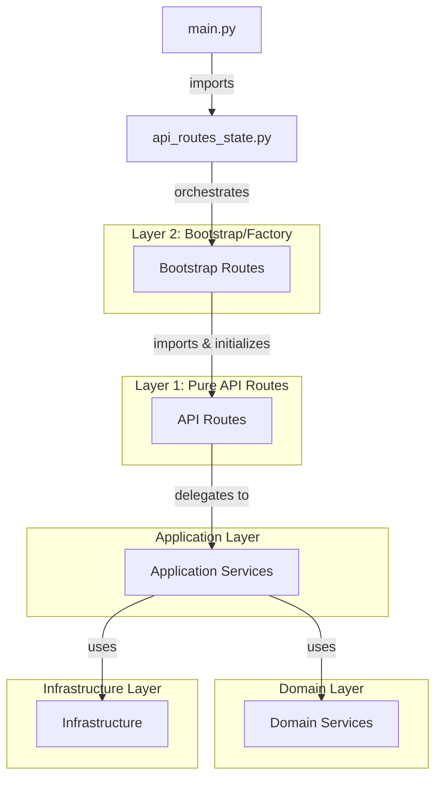

# Routing Architecture - TheOpenMusicBox

## Overview

TheOpenMusicBox implements a **two-layer routing architecture** following Domain-Driven Design (DDD) and Dependency Injection principles. This architecture separates HTTP route handling from dependency management, providing better testability, maintainability, and adherence to SOLID principles.

## Architecture Layers

### Layer 1: Pure API Routes (`back/app/src/api/endpoints/`)

**Purpose**: Pure HTTP route handlers with FastAPI route definitions

**Responsibilities**:
- Define FastAPI route endpoints with decorators
- Handle HTTP request/response logic
- Perform input validation using Pydantic models
- Delegate business logic to application services
- Format and return standardized responses
- Handle route-specific error scenarios

**Key Characteristics**:
- **No direct dependency instantiation** - receives dependencies via constructor
- **No lifecycle management** - doesn't start/stop services
- **Pure route logic** - focused solely on HTTP handling
- **Testable in isolation** - can be tested without full app context

**File Pattern**: `*_api_routes.py`

**Example Classes**:
- `PlayerAPIRoutes` - Player control endpoints (play, pause, seek, volume)
- `NFCAPIRoutes` - NFC tag association and scanning endpoints
- `PlaylistAPIRoutes` - Playlist CRUD and management endpoints
- `SystemAPIRoutes` - System health and status endpoints

### Layer 2: Bootstrap/Factory Routes (`back/app/src/routes/factories/`)

**Purpose**: Dependency wiring, initialization, and route registration

**Responsibilities**:
- Import and instantiate API route classes
- Initialize required services and dependencies
- Configure dependency injection (getter functions)
- Register routes with FastAPI application
- Manage service lifecycle (startup/shutdown)
- Coordinate between multiple services

**Key Characteristics**:
- **Dependency orchestration** - creates and wires dependencies
- **Lifecycle management** - handles service initialization and cleanup
- **Registration coordination** - registers routes with FastAPI
- **Factory pattern** - acts as a factory for route handlers

**File Pattern**: `*_routes.py`, `*_routes_ddd.py`, `unified_*_routes.py`

**Example Classes**:
- `PlayerRoutesDDD` - Bootstraps player routes with services
- `UnifiedNFCRoutes` - Bootstraps NFC routes with hardware adapters
- `PlaylistRoutesDDD` - Bootstraps playlist routes with application services
- `SystemRoutes` - Bootstraps system routes with coordinator

## Dependency Flow



## File Mapping

All 7 route domains follow this consistent pattern:

| Domain | API Routes (Layer 1) | Bootstrap Routes (Layer 2) | LOC Ratio |
|--------|---------------------|---------------------------|-----------|
| Player | `api/endpoints/player_api_routes.py` | `routes/factories/player_routes_ddd.py` | 480 → 148 |
| NFC | `api/endpoints/nfc_api_routes.py` | `routes/factories/nfc_unified_routes.py` | 413 → 110 |
| Playlist | `api/endpoints/playlist_api_routes.py` | `routes/factories/playlist_routes_ddd.py` | 1,045 → 224 |
| System | `api/endpoints/system_api_routes.py` | `routes/factories/system_routes.py` | 307 → 71 |
| Upload | `api/endpoints/upload_api_routes.py` | `routes/factories/upload_routes.py` | 240 → 72 |
| Web | `api/endpoints/web_api_routes.py` | `routes/factories/web_routes.py` | 121 → 61 |
| YouTube | `api/endpoints/youtube_api_routes.py` | `routes/factories/youtube_routes.py` | 223 → 75 |

**Total**: ~2,829 LOC in API routes, ~761 LOC in bootstrap routes

## Code Examples

### Layer 1: Pure API Route (Simplified)

```python
# back/app/src/api/endpoints/player_api_routes.py
class PlayerAPIRoutes:
    """Pure API routes handler for player operations."""

    def __init__(self, player_service, broadcasting_service):
        self.router = APIRouter(prefix="/api/player", tags=["player"])
        self._player_service = player_service
        self._broadcasting_service = broadcasting_service
        self._register_routes()

    def _register_routes(self):
        @self.router.post("/play")
        async def play_player(body: PlayerControlRequest):
            # Pure HTTP handling - no service instantiation
            result = await self._player_service.play_use_case()

            if result.get("success"):
                status = result.get("status", {})
                await self._broadcasting_service.broadcast_playback_state_changed(
                    "playing", status
                )
                return UnifiedResponseService.success(
                    message="Playback started",
                    data=status
                )

    def get_router(self) -> APIRouter:
        return self.router
```

### Layer 2: Bootstrap Route (Simplified)

```python
# back/app/src/routes/factories/player_routes_ddd.py
class PlayerRoutesDDD:
    """Bootstrap class for player routes - handles DI and lifecycle."""

    def __init__(self, app: FastAPI, socketio: AsyncServer, playback_coordinator):
        self.app = app
        self.socketio = socketio

        # Initialize services (dependency management)
        self.state_manager = UnifiedStateManager(self.socketio)
        self.player_application_service = PlayerApplicationService(
            playback_coordinator, self.state_manager
        )
        self.broadcasting_service = PlayerBroadcastingService(self.state_manager)

        # Initialize API routes with dependencies
        self.api_routes = PlayerAPIRoutes(
            player_service=self.player_application_service,
            broadcasting_service=self.broadcasting_service
        )

        # Register routes with FastAPI
        self.app.include_router(self.api_routes.get_router())
```

## Design Patterns Used

### 1. Factory Pattern
Bootstrap routes act as factories, creating and configuring route handlers with their dependencies.

### 2. Dependency Injection (DI)
Dependencies are injected via constructor parameters, following the Dependency Inversion Principle.

### 3. Single Responsibility Principle (SRP)
- API routes: HTTP handling only
- Bootstrap routes: Dependency management only
- Application services: Business logic only

### 4. Separation of Concerns
Clear separation between route handling, dependency wiring, and business logic.

## Benefits

### 1. Testability
- **API routes** can be tested independently with mocked dependencies
- **Bootstrap routes** can be tested for correct wiring
- **Services** can be tested in isolation

### 2. Maintainability
- Changes to route logic don't affect dependency management
- Changes to dependencies don't affect route definitions
- Clear responsibility boundaries

### 3. Flexibility
- Easy to swap service implementations
- Simple to modify dependency graphs
- Supports multiple initialization strategies

### 4. Clean Architecture
- Follows DDD layering principles
- Respects dependency direction (inward toward domain)
- Enables hexagonal/onion architecture

## Common Patterns

### Dependency Getter Functions

Bootstrap routes often create getter functions for lazy dependency resolution:

```python
def get_nfc_service(request):
    """Get NFC service from domain application."""
    application = getattr(request.app, "application", None)
    if not application:
        raise service_unavailable_error("Domain application not available")
    return getattr(application, "_nfc_app_service", None)

self.api_routes = NFCAPIRoutes(
    nfc_service_getter=get_nfc_service,
    state_manager_getter=get_state_manager
)
```

### State Manager Integration

Most bootstrap routes initialize the `UnifiedStateManager` for WebSocket broadcasting:

```python
self.state_manager = UnifiedStateManager(self.socketio)
self.broadcasting_service = PlayerBroadcastingService(self.state_manager)
```

### Route Registration

Bootstrap routes register the API router with FastAPI:

```python
self.app.include_router(self.api_routes.get_router())
# or with custom prefix
self.app.include_router(self.api_routes.get_router(), prefix="/api/nfc", tags=["nfc"])
```

## Initialization Sequence

1. **main.py** creates FastAPI app and Socket.IO server
2. **Domain Bootstrap** initializes domain layer services
3. **APIRoutesState** orchestrates route initialization
4. **Bootstrap Routes** (Layer 2) are instantiated with app/socketio
5. **API Routes** (Layer 1) are created by bootstrap routes
6. Routes are registered with FastAPI
7. Background services are started
8. Application ready to handle requests

## Migration Guide

### From Old Pattern to New Pattern

**Old (coupled):**
```python
@app.get("/api/player/status")
async def get_status():
    coordinator = get_playback_coordinator()  # Direct dependency access
    return coordinator.get_status()
```

**New (layered):**

**API Route:**
```python
class PlayerAPIRoutes:
    def __init__(self, player_service):
        self._player_service = player_service

    def _register_routes(self):
        @self.router.get("/status")
        async def get_status():
            return await self._player_service.get_status_use_case()
```

**Bootstrap:**
```python
class PlayerRoutesDDD:
    def __init__(self, app, coordinator):
        self.player_service = PlayerApplicationService(coordinator)
        self.api_routes = PlayerAPIRoutes(self.player_service)
        app.include_router(self.api_routes.get_router())
```

## Best Practices

### 1. Keep API Routes Pure
- No service instantiation in API routes
- No global state access
- All dependencies via constructor

### 2. Centralize Dependency Wiring
- All DI logic in bootstrap routes
- Use getter functions for lazy resolution
- Document dependency requirements

### 3. Follow Naming Conventions
- API routes: `*APIRoutes` classes
- Bootstrap routes: `*Routes`, `*RoutesDDD`, `Unified*Routes` classes
- Keep file names consistent with class names

### 4. Manage Lifecycle Properly
- Initialize services in bootstrap routes
- Provide cleanup methods when needed
- Handle startup/shutdown gracefully

### 5. Document Dependencies
- Clearly document required dependencies in docstrings
- Explain dependency purpose and lifetime
- Note any optional dependencies

## Troubleshooting

### Issue: Service Not Available
**Symptom**: 503 Service Unavailable errors

**Check**:
1. Bootstrap route properly initializes service
2. Dependency getter function handles missing services
3. Service is added to application context

### Issue: Routes Not Registered
**Symptom**: 404 Not Found errors

**Check**:
1. Bootstrap route calls `app.include_router()`
2. Router prefix is correct
3. Route is registered in `api_routes_state.py`

### Issue: Circular Dependencies
**Symptom**: Import errors or initialization failures

**Solution**:
- Use getter functions for lazy resolution
- Review dependency graph
- Consider dependency inversion

## Related Documentation

- [Backend Services Architecture](./backend-services-architecture.md) - Overall DDD architecture
- [Domain Layer](../back/app/src/domain/README.md) - Domain services
- [Application Layer](../back/app/src/application/README.md) - Application services
- [API Layer](../back/app/src/api/endpoints/README.md) - Pure API routes
- [Bootstrap Layer](../back/app/src/routes/factories/README.md) - Dependency wiring

## Summary

The two-layer routing architecture is **intentional, not duplication**. It provides:

✅ Clear separation of concerns
✅ Better testability and maintainability
✅ Flexible dependency management
✅ Clean architecture compliance
✅ Consistent patterns across all domains

This architecture supports the DDD principles used throughout TheOpenMusicBox and enables scalable, maintainable backend development.
